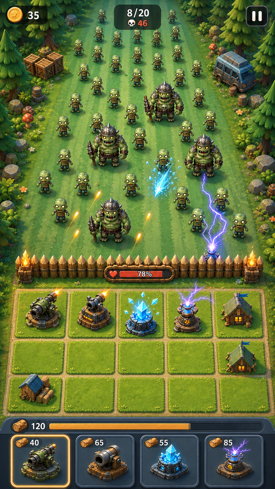

# ZCamp 主战场高保真概念稿

> 日期：2026-08-11  
> 状态：v3 当前视觉样板【2026-08-11 已确认】  
> 布局上位规范：[方案 H](../layout-concepts/h-threat-field-royal-hand.svg)  
> UI 上位规范：[ZCamp UI Bible](../../ui/ZCamp_UI_Bible.md)

## v3 当前视觉样板

- v3 针对上一稿的品质感、格位一致性和建筑落位重新制作；
- 防守区现在是一整块严格 5 列×3 行棋盘，15 格共用同一尺寸、间距与分割线体系；
- 七个已放置建筑的底座、锚点和接触阴影均限制在各自单格内；
- 渲染方向升级为高品质休闲 3D：更厚实的造型、更清楚的材质分层、受控高光和接触阴影，同时保持高明度与非写实；
- [v3 生成提示词与几何验收口径](./zcamp-battle-screen-hifi-v3-prompt.md)；
- 本稿已于 2026-08-11 确认为当前视觉样板，后续 Art Bible、UI Bible、实机与外包验收均以此校准。

## 交付图

- `zcamp-battle-screen-hifi-v3-master.png`：当前生成母版，保留较高分辨率；
- `zcamp-battle-screen-hifi-v3-720x1280.png`：对应项目逻辑画布的当前视觉样板；
- [v3 生成提示词与几何验收口径](./zcamp-battle-screen-hifi-v3-prompt.md)；
- v1 文件保留为暗黑写实否定对照；v2 与 v2.1 保留为中间迭代，均不再作为当前样板。

## 本稿已验证

- 尸潮战区约占屏高六成，玩家营地保持小而脆弱；
- 城墙是薄而明确的唯一横向防线，耐久贴墙显示；
- 城内完整显示 5 列×3 行，共 15 个可数地基；
- 底部固定四卡，成本与塔种清楚，默认共用中性卡壳；
- 木材资源轨道分隔格区和卡牌区；每张卡用木材图标 + 数字表达成本；
- 城墙没有固定炮位，耐久嵌在墙体，所有塔都属于 5×3 格位；
- 画面使用中高明度、大色块和高品质休闲 3D；低噪声不等于低质感，造型必须有厚度，材质必须有分层，并使用受控高光、倒角与接触阴影；
- 15 格共用同一视觉模板和连续分割线，建筑底座、锚点与接触阴影均落在单格内；
- 没有开波按钮、循环卡组、下一张牌或 PvP 镜像结构；
- 冷色尸潮、暖色营地和局部功能色形成清楚层级。

## 基准决定

自 2026-08-11 起，v3 作为主战场当前视觉样板。后续概念稿、Phaser 实机、外包需求和 AI 辅助出图必须保持以下不变量：高品质但非写实的休闲 3D、清楚材质分层与受控高光、单向大尸潮、薄且无固定炮位的城墙、贴墙后的严格同构 5×3、建筑精确落格、横向木材资源轨道和固定四卡。新稿只有在明确评审通过后才能替换该样板。

## 尚未锁定

- 最终字体、图标笔触与文字基线；
- 真机底部安全区和不同长宽比下的卡牌缩放；
- 15 格的最终像素尺寸、触控热区，以及建筑上部轮廓允许超出地基但不得侵入相邻核心热区的数值；
- 实际同屏数量、VFX 预算和低端设备可读性；
- 木材资源轨道的填充是否对应真实容量上限；
- 前排塔允许越墙多少，以及弹道与墙体耐久的避让规则。

本稿是审美、比例和层级的当前基准，不作为 Phaser 中的像素级布局标注，也不作为可直接拆分上线的最终美术资源。
