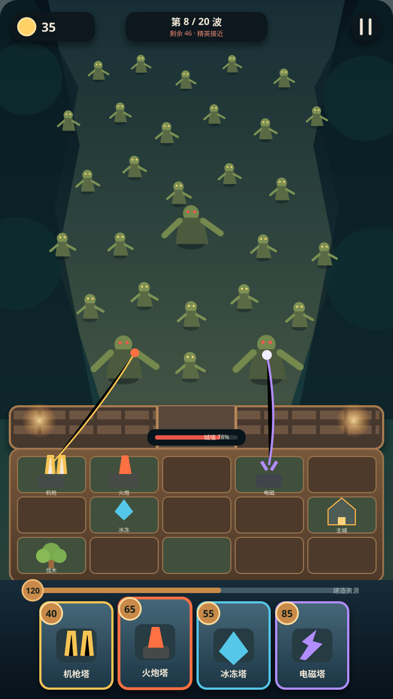
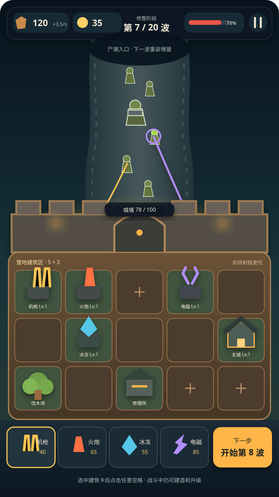
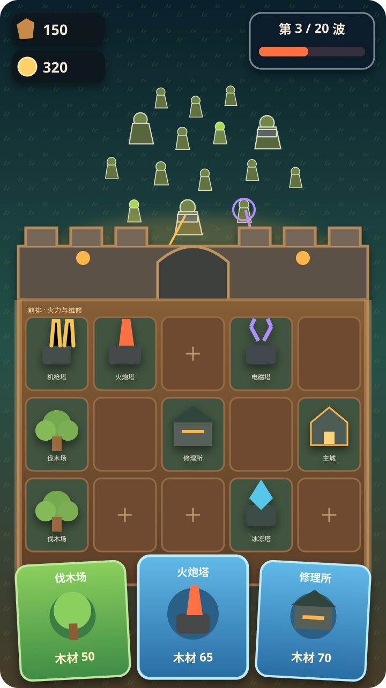
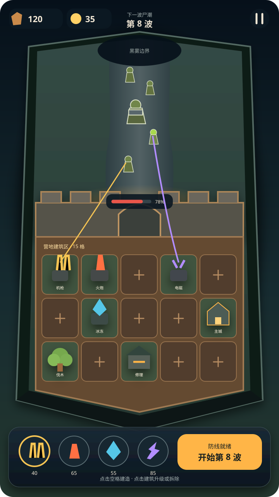

# ZCamp 主战场界面布局方案

> 日期：2026-08-11  
> 基准画布：720×1280 竖屏  
> 状态：方案 H 为当前布局基线；高保真 v3 为当前视觉样板；5 列×3 行建筑格为产品硬约束  
> 详细规范：[ZCamp UI Bible](../../ui/ZCamp_UI_Bible.md)

## 高保真视觉稿 v3（当前样板）

v3 已确认为当前视觉方向与交互语义样板。它在保留方案 H、长尸潮纵深、薄城墙、木材资源轨道和固定四卡的基础上，将画面提升为高品质但非写实的休闲 3D，并把防守区收紧为一整块严格同构的 5×3 棋盘：15 格共享尺寸、间距和连续分割线，建筑底座与接触阴影精确落入单格。它不是可直接切图上线的最终资产，但后续实机、资产和 UI 评审均以它为对照。

## 方案 H：大尸潮战区 + 四卡手牌（当前基线）

第三轮母版将尸潮战区扩大到约六成屏高，把城墙与 5×3 营地压缩成最下方的最后阵地。敌人从远处铺到墙前，玩家防线在视觉上始终处于被压迫的位置。

底部参考《皇室战争》的四张竖向手牌：成本徽记在左上、建筑图标居中、名称在底部；选中卡轻微上抬。这里只借鉴布局与反馈，不引入循环卡组或圣水规则。

方案 H 是布局线框，不是最终 UI 皮肤：当前四张卡的彩色外框是占位，正式稿使用统一中性卡壳，塔种色只用于图标与选中内辉。横向木材资源轨道已确认保留，用于分隔格区和卡牌区；它不复制分段圣水机制，具体填充语义必须与木材容量规则一致。

主战场没有“开始下一波”按钮。每波结束自动进入商店，关闭商店后显示不可点击的 `3—2—1`，随后自动开波。

**当前区域比例**

- 尸潮战区：约 58%～63%；
- 城墙：约 5%～7%；
- 5×3 建造区：约 18%～22%；
- 四卡手牌：约 15%～17%。

## 共同骨架

三版都遵循同一条纵向信息结构：

1. 上方尸潮战区；
2. 横跨屏幕的城墙与耐久；
3. 城墙后方完整可见的 5×3 建造区；
4. 最底部建筑选择、资源与主操作。

《永远的蔚蓝星球》只用于参考“敌群战区—城墙阵线—底部操作”的竖屏分层。它采用随机召唤与同类合成，现有一手证据也不支持 5×3，因此 ZCamp 不照搬它的槽位形态与操作规则。详见：[实机战场 UI 调研](../../research/2026-08-11-blue-planet-battle-ui.md)。

## 方案 E：5×3 均衡母版（推荐）

以 MVP 的可读性和可实现性为先：上方保留尸潮空间，中部城墙明确分界，下方 15 格完整可见，底部四塔卡保持紧凑。该版营地占比仍然偏大，已由方案 H 取代。

**适合保留**

- 四种塔固定顺序，符合当前确定性选择与落位；
- 格区、城墙、尸潮和操作区互不争抢语义；
- 修整态可展开成本与按钮，战斗态只压缩底栏，不移动棋盘；
- 最容易直接转换成 Phaser 响应式布局。

**需要验证**

- 360px 宽下塔名是否仍需常驻，还是只保留图标与成本；
- 建筑允许越出格框多少，既有商品感又不遮住相邻操作；
- 城墙血条贴墙显示时是否会与前排塔的攻击反馈竞争。

## 方案 F：三卡抽选 / 轮换建造

这版最接近用户示意图的气质：尸潮压境、厚重城墙、5×3 城内格区，以及三张大建筑卡。大卡更容易展示建筑插画、名称和成本。

**适合保留**

- 新手一眼能理解“从下方选建筑，放入上方空格”；
- 三张大卡适合随机轮换、三选一或抽卡式建造；
- 截图中的建筑商品感最强。

**限制**

- 若四塔始终全部可选，三卡会制造不必要的轮换规则；
- 大卡占屏较高，战斗态必须收起；
- 不应为了贴近参考图而把 5×3 改成其画面中的 4×3。

## 方案 G：微缩营地沙盘

把尸潮区、城墙和 5×3 营地包装为一块完整的夜间微缩模型，弱化 UI 网格感，强化 Art Bible 的“末日夜营地微缩模型”。

**适合保留**

- 视觉识别度与商品截图潜力最高；
- 暖营地与冷尸潮的对比最完整；
- 格子可由地基、铆钉、木框和灯带构成，不像开发面板。

**需要验证**

- 触控热区不能跟着透视后的可见地砖一起缩小；
- 复杂建筑轮廓不能遮住相邻格的占用与选中状态；
- 伪等距角度必须统一，避免 15 格数量被透视误读。

## 第二轮推荐合成方向（已被 H 取代）

> 方案 E/G 的营地占比偏大，防守压力不足；其微缩材质与格位状态可以复用，但不再作为屏幕比例母版。

具体执行：

- 尸潮、城墙、格区和底栏比例以方案 H 为准；
- 5×3 始终完整可见，选中建筑后统一点亮合法格；
- 前排靠墙强化防御语义，中排混合，后排强化经济与营地语义；
- 四塔选择改用 H 的《皇室战争》式手牌，战斗与倒计时期间位置不变；
- 只有在玩法明确改为三卡轮换或抽选时，才采用 F 的大卡底栏。

## 已归档的第一轮方案

方案 A～D（`a-royal-deck.svg`、`b-lucky-grid.svg`、`c-diorama-minimal.svg`、`d-survival-overlay.svg`）基于“10 个建筑位映射到道路两侧”的错误假设，已被第二轮方案取代。它们仅保留作交互组件草图，不再作为主战场构图候选。

## 下一轮验证项

1. 为推荐合成版绘制修整态、战斗态和强化态；
2. 在 360px 宽截图下做五秒识别测试；
3. 验证 15 个格子的点击/拖放热区至少为 56×56 逻辑像素；
4. 验证前排塔越墙攻击时，弹道与城墙耐久仍能清楚读取；
5. 用当前 Phaser 状态数据制作低保真可点击原型，并记录 720×1280 与窄屏截图。
