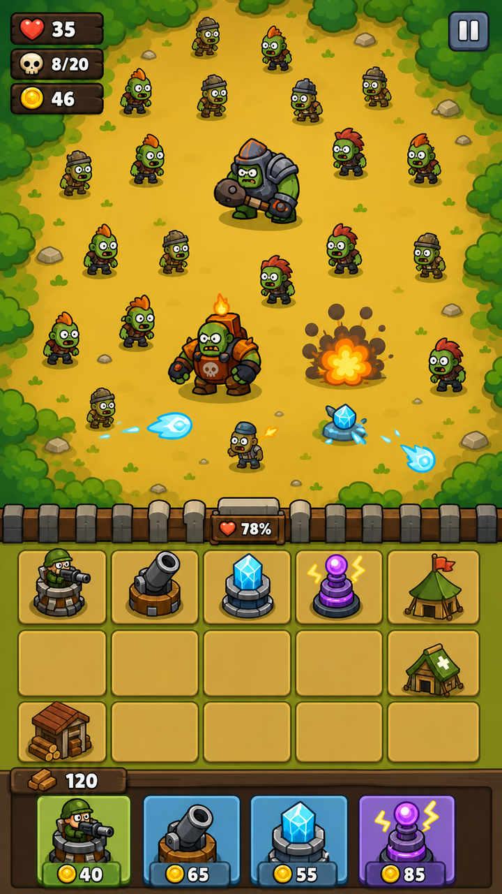
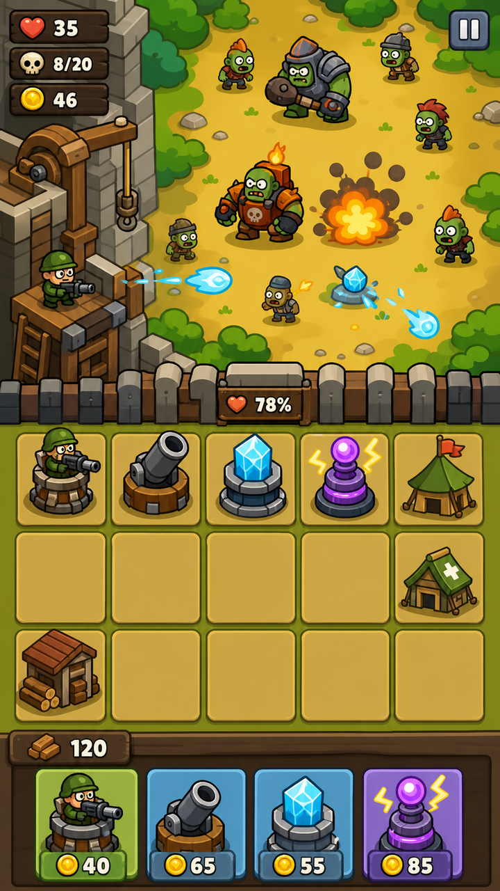
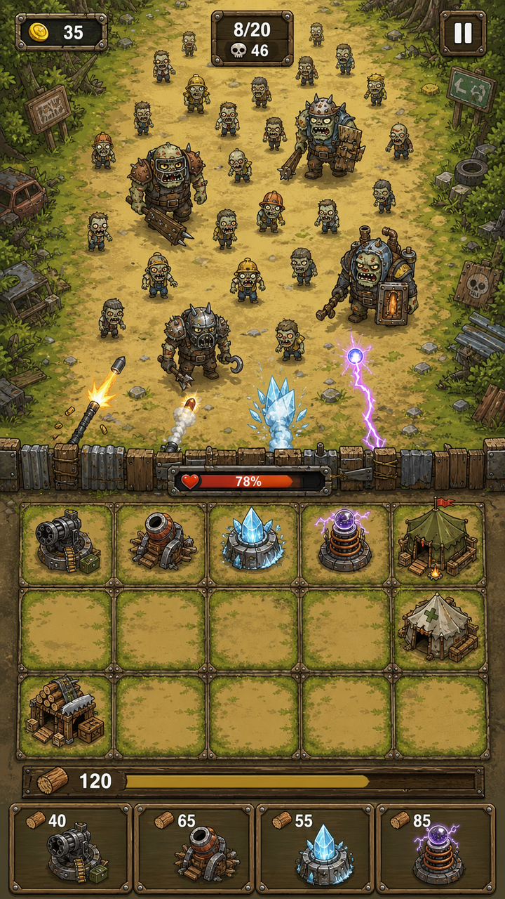
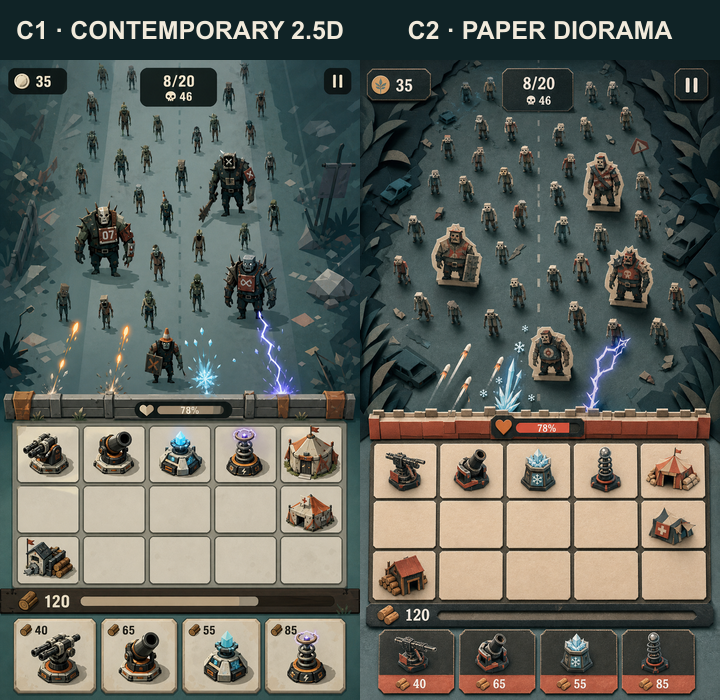
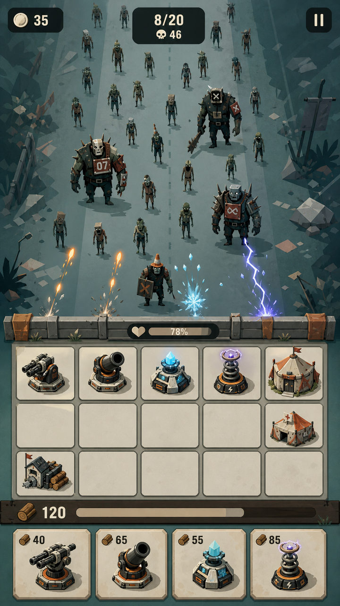
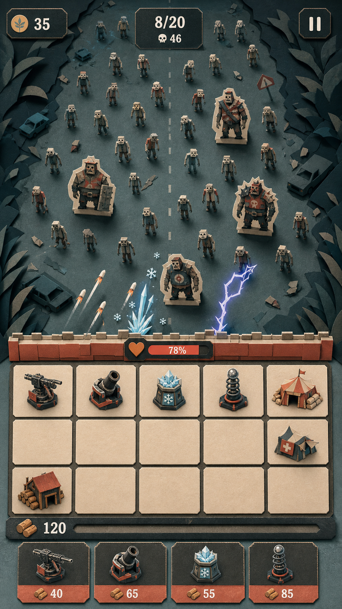
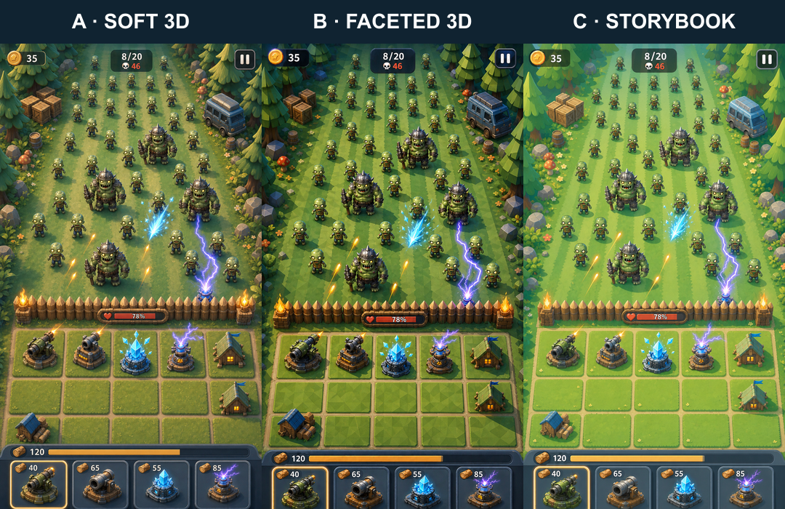
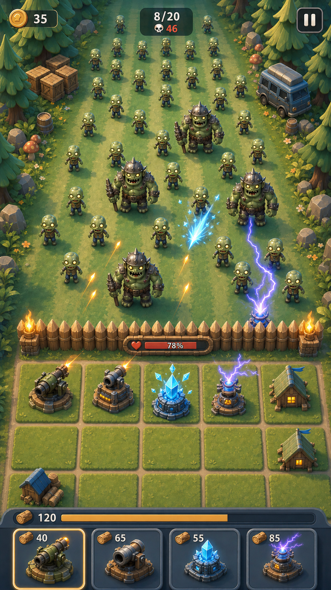
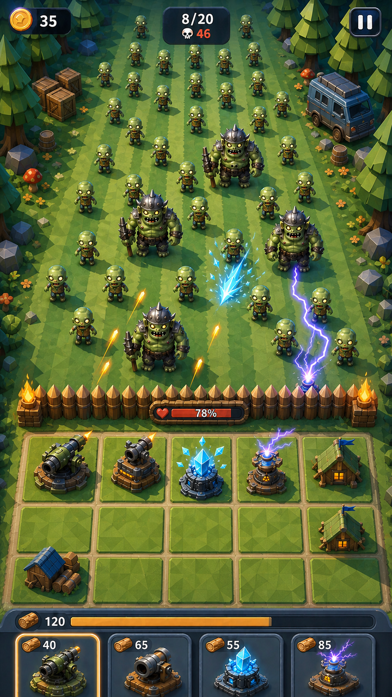
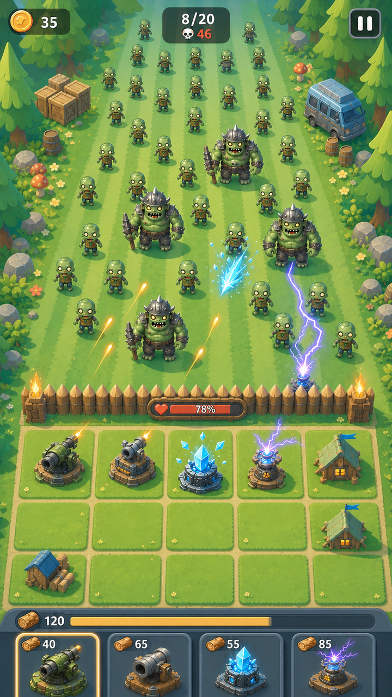

# ZCamp 主战场艺术风格对照

> 日期：2026-08-11  
> 状态：D3 已确认，并已升级为主战场 UI 矢量母版  
> 结构母版：[主战场高保真概念稿 v3](../concepts/zcamp-battle-screen-hifi-v3-720x1280.png)

## 第三轮：手绘漫画塔防方向

### D3：危机比例修订



D3 保留 D2 的块面卡通语言，只修正纵向空间关系：敌军战场约占 56%，薄城墙约占 4%，严格 5×3 防守格约占 25%，木材轨道与四卡约占 15%。格位允许使用同尺寸横向矩形，避免为了方格感把玩家区域重新放大。敌人按远小近大重新铺满扩大的战场，精英压力集中在靠近城墙的位置。

文件：`zcamp-style-d3-threat-layout-master.png`、`zcamp-style-d3-threat-layout-720x1280.png`。

D3 已通过评审。正式母版为 [D3 主战场 UI SVG](../../ui/visuals/zcamp-battle-ui-d3-vector.svg)，Art Bible 与 UI Bible 已同步更新。

### D2：块面卡通减法修订



D 版的结构与二维手绘方向成立，但材质、废料零件和环境碎物过多，导致画面仍偏写实、偏重。本次只调整造型与渲染复杂度，不重新设计布局：

- 内部纹理线、场景碎物和材质噪声减少约 55%–65%，小碎形合并为更大的连续色块；
- 角色头部放大、四肢缩短加粗，靠头身比、表情与整体轮廓区分普通僵尸和精英；
- 精英护甲只保留三至五个主块，建筑只保留四至六个主要组件，不再堆叠铆钉、管线和废铁零件；
- 全画面统一为粗外轮廓、少量内部线、两档赛璐璐明暗和一个小高光，不使用写实渐变或颗粒材质；
- 地面、树林、城墙、格子与 UI 均改为大块面表达，战斗特效改用简短星爆、圆弧和烟团；
- 保留单向尸潮、薄城墙、严格同尺寸 5×3、七个建筑锚点、木材轨道和固定四卡。

文件：`zcamp-style-d2-blocky-cartoon-td-master.png`、`zcamp-style-d2-blocky-cartoon-td-720x1280.png`。

核心提示词摘要：

```text
Same approved ZCamp composition; substantially more cartoonish, simpler and block-shaped; reduce internal detail and prop clutter by 55–65%; bold clean outer contours; flat colors with two cel-shaded values; larger heads and shorter thicker limbs; 3–5 armor panels per elite; 4–6 major shapes per building; broad golden dirt and olive foliage masses; simplified chunky wood/stone UI.
```

D2 仍是评审候选。只有评审明确通过后，才把其中的块面比例、细节预算和角色头身规则写入 Art Bible / UI Bible。

### D：细节较多的手绘漫画塔防初稿



本轮使用用户提供的《Kingdom Rush》实机图作为视觉语法参考，但不复制其角色、塔、路线、地图、按钮或 UI。继续从[中性结构控制图](./zcamp-neutral-structure-control.png)重新渲染 ZCamp。

- 使用有粗细变化的深棕 / 炭色手绘轮廓，外轮廓重、内部材质线轻；
- 每个对象采用两到三档赛璐璐明暗和少量手绘高光，不使用 3D 塑料材质或低多边形切面；
- 僵尸分为办公室残骸、瘦长拾荒者和矮壮工人三类基础体型；四个精英使用更宽的肩部和废料护甲；
- 战场改为长满杂草的废弃道路，中央保持低噪声，树木、路牌、废车和残骸集中在边缘；
- 防线、建筑和 UI 统一使用手绘木、石、废铁与羊皮纸语法；
- 攻击反馈使用短促星爆、弧线、弹壳和漫画式碎片，但不加入文字拟声；
- 画面仍保持单向尸潮、薄城墙、严格 5×3、木材轨道和固定四卡。

文件：`zcamp-style-d-hand-drawn-cartoon-td-master.png`、`zcamp-style-d-hand-drawn-cartoon-td-720x1280.png`。

核心提示词摘要：

```text
Premium hand-drawn 2D cartoon tower-defense illustration; lively charcoal ink contours with organic thickness; two or three cel-shaded value steps; exaggerated readable proportions; overgrown abandoned roadside; humorous asymmetrical zombies; improvised timber, stone and scrap-metal defense; hand-painted wood/stone/parchment UI; graphic impact bursts and motion streaks.
```

明确禁止复制参考游戏中的具体角色、塔、地图路线、城堡、图标、文字和按钮；只借鉴二维手绘塔防的视觉语法。

## 第一轮评审结论

第一轮三张候选均未达到目标：A、B 仍延续旧版的绿色玩具森林、圆润手游低模和厚重深蓝卡框；C 只在明亮大色块与低表面噪声上提供了可继续探索的线索，但仍不作为可用方向。第一轮文件保留为否定对照，不进入 Art Bible。

## 第二轮：从中性结构重新设计

第二轮不再直接编辑 v3。先把已经确认的布局抽离为一张不带美术语言的[中性结构控制图](./zcamp-neutral-structure-control.png)，只保留尸潮点位、薄城墙、严格 5×3、建筑锚点、资源轨道和四卡，再从该图分别发展 C1 与 C2。



### C1：现代商业插画 2.5D



- 冷静的灰蓝绿威胁区、暖珊瑚防线和象牙白信息层；
- 现代编辑插画式的大形、克制渐变和浅层 2.5D 阴影；
- 僵尸改为不对称、瘦长、带轻黑色幽默的多体型剪影；
- UI 改为薄、哑光、精确的图形模块，不使用金属厚框和发光描边。

文件：`zcamp-style-c1-contemporary-2-5d-master.png`、`zcamp-style-c1-contemporary-2-5d-720x1280.png`。

### C2：高级纸雕微缩



- 深炭青、灰蓝、纸张米色和低饱和珊瑚构成签名配色；
- 敌人、建筑、地形和 UI 使用一致的裁纸层级、印刷色块与浅投影；
- 僵尸像设计师桌游中的纸质立牌，建立更强的独特性和收藏感；
- 保留危机感，避免幼儿手工、牛皮纸单色和可爱折纸方向。

文件：`zcamp-style-c2-paper-diorama-master.png`、`zcamp-style-c2-paper-diorama-720x1280.png`。

### 第二轮共同提示词差异

```text
C1: premium contemporary editorial-game illustration; crisp broad silhouettes; restrained soft gradients; shallow 2.5D depth; petrol teal and blue-gray threat field; warm coral and parchment defense; thin matte charcoal UI.

C2: sophisticated layered paper diorama; laser-cut printed-card shapes; controlled paper edge thickness; subtle uncoated grain; charcoal teal threat field; parchment and muted coral defense; slim printed-card UI modules.
```

两版都禁止继承旧版的圆锥松树、草皮格、花朵蘑菇、绿色塑料僵尸、深蓝金属卡框、橙色发光选中框和农场手游气质。

## 第一轮图像留档



## A：精致柔绘休闲 3D



- 圆润厚实的剪影；
- 平滑手绘渐变和柔和倒角；
- 暖色高光、蓝绿色阴影和克制材质变化；
- 目标是获得高商品感，同时避免写实、低模切面和塑料感。

文件：`zcamp-style-a-soft-painted-3d-master.png`、`zcamp-style-a-soft-painted-3d-720x1280.png`。

## B：几何切面冒险 3D



- 强剪影与清楚的几何面；
- 更高的明暗对比和功能色识别；
- 青绿色环境、暖色火光和深蓝 UI；
- 目标是提高高密度战斗可读性，同时避免廉价低多边形资产包观感。

文件：`zcamp-style-b-faceted-adventure-3d-master.png`、`zcamp-style-b-faceted-adventure-3d-720x1280.png`。

## C：明亮平面绘本



- 矢量般的大色块、轻渐变和低表面纹理；
- 更明亮的青绿环境和金色日光；
- 建筑、角色与 UI 统一转向 2D / 2.5D 插画；
- 仍保留深青敌人和橙红危险色，避免完全失去尸潮压力。

文件：`zcamp-style-c-luminous-storybook-master.png`、`zcamp-style-c-luminous-storybook-720x1280.png`。

## 共同结构不变量

- 敌军区保持画面绝对主体；
- 城墙保持薄、连续、无固定炮位，`78%` 耐久嵌在墙体中央；
- 防守区固定 5 列×3 行，共 15 个同构格位；
- 第一排依次为机枪、火炮、冰冻、电磁和主帐，第二排第五格为支援帐篷，第三排第一格为伐木场；
- 建筑底座、锚点和接触阴影完整落在单格内；
- 木材轨道位于格区和卡牌之间，显示 `120`；
- 底部四卡成本为 `40 / 65 / 55 / 85`；
- 顶部 HUD 保持 `35`、`8/20`、`46` 和暂停；
- 不增加开波按钮、额外卡牌、额外建筑或资源。

## 生成方式与提示词差异

三版均使用内置 `image_gen` 的风格转换模式。共同提示词要求只改变渲染风格并保留上述结构；差异提示词分别为：

```text
A: premium soft-painted stylized 3D; rounded substantial silhouettes; smooth hand-painted gradients; clean soft bevels; warm cream highlights; cool blue-green shadows; subtle ambient occlusion and restrained dimensional UI.

B: deliberately geometric high-end stylized 3D; clear angular planes; broad painted facets; crisp value grouping; saturated teal-green environment; warm amber accents; deep blue UI with pale edging.

C: bright premium flat storybook illustration; layered vector-like shapes; simplified graphic silhouettes; subtle gradient bands; luminous cyan-green palette; warm golden light; polished 2D/2.5D UI.
```

当前 Art Bible 和 UI Bible 仍以 v3 为正式样板；只有评审明确选定某一方向后，才更新主风格规则。
