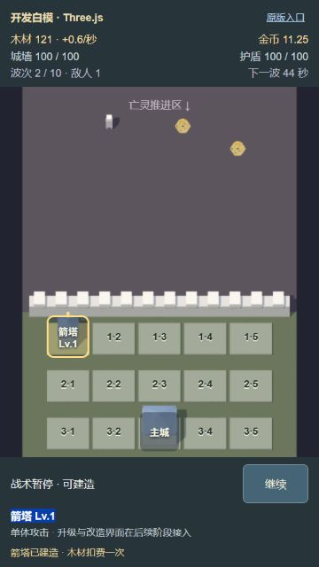
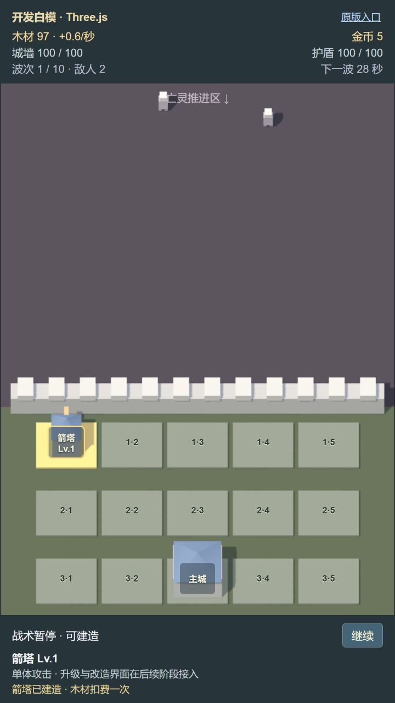
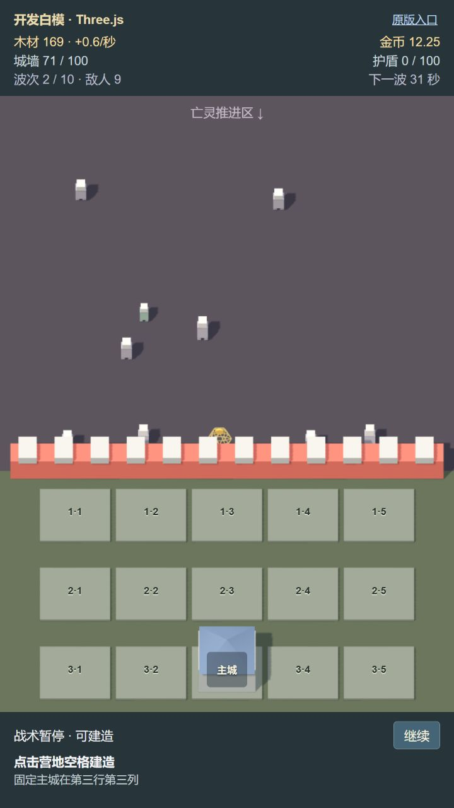
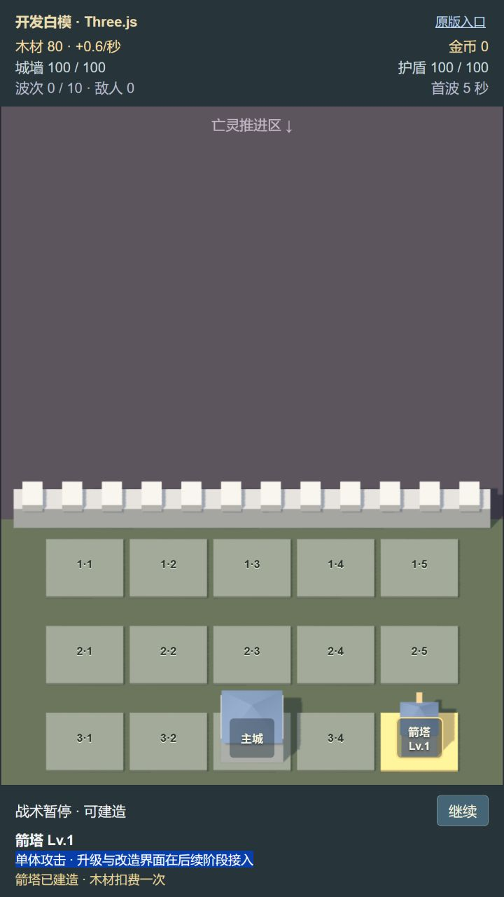

# Issue #2：可玩的 Three.js 白模防线

日期：2026-10-09。实现基线：`48d28b45aab0d07c8ce19ff99c4b31b1a286e182`。分支：`codex/threejs-issue-2`。

这是阶段 A 开发白模，正式默认入口继续使用 Phaser。完整成长操作、精修资产、正式大厅迁移及实体设备性能分别由后续 Issues 验收。

## 运行与复现

```bash
npm ci
npm run dev -- --host 127.0.0.1 --port 5178 --strictPort
```

- 开发白模：`http://127.0.0.1:5178/?preview=threejs`。
- 旧默认入口：`http://127.0.0.1:5178/`。
- 固定种子 1337，既有英雄 `camp_warden`、关卡 `first_defense`；5 秒首波准备时间。
- 构建后用 `npm run preview -- --host 127.0.0.1 --port 4188 --strictPort`，入口相应为 `/Game-ZCamp/?preview=threejs` 与 `/Game-ZCamp/`。

1. 设置浏览器视口为 360×640，进入白模后点击「暂停」。依次点击第一、二行的五格与第三行除主城外的四格，底栏应准确显示对应行列；主城固定在第三行第三列。
2. 暂停中选择第一行第一列，双击「建造箭塔｜木材 40」。开局木材 120→80，仅出现一座 Lv.1 箭塔，建造按钮消失。点击主城只显示固定主城说明。
3. 点击「继续」，首波倒计时继续；敌人向墙移动，箭塔/驻守英雄攻击，命中闪光、死亡反馈和金币浮动随真实事件出现。再暂停，资源、有效时间、敌人和战斗反馈停留在同一状态。
4. 将窗口移到后台，再返回。系统暂停期间不能点击格位；返回保留原战术暂停。运行中返回只继续正常固定步，不追算离开期间的时间。
5. 改为 720×1280 重复选取、建造和暂停流程。格位标签随正交镜头投影更新，不出现错位、重叠或裁切。
6. 点击「原版入口」，从大厅进入原有战斗，验证倒计时、建造与暂停继续可用。

## 高层会话与 TDD 证据

测试边界沿用已确认的 `GameCommand` / `GameState` / `GameEvent`，仅新增 `BattleSession` 公共边界。没有测试私有渲染方法、模型层级或材质数量。

| 纵向切片 | 实际 red | green 行为 |
| --- | --- | --- |
| 一次建造与事件交付 | `Cannot find module '../../src/core/battleSession'` | 重复命令第二次拒绝；木材 120→80；仅一个建造事件，事件再次读取为空 |
| 同一种子及按步输入 | `slow.advance is not a function` | 30/60 FPS 到第 900 步时完整状态与事件一致；同样输入直接驱动既有 `GameSimulation` 也完全一致；包含真实攻击、死亡和奖励 |
| 暂停冻结 | `expected 5 to be +0` | 暂停时不消耗模拟步，资源与敌人不变；战术暂停可建造、系统暂停拒绝建造；返回不解除战术暂停；丢弃暂停前半步积压 |
| 长帧与后台时间戳 | `session.advanceFrame is not a function` | 长帧最多 5 步，每步 1/30 秒；后台恢复首帧推进 0 步，下一正常帧推进 1 步 |
| 会话生命周期 | `session.dispose is not a function` | 系统暂停返回词条状态，选词条恢复原阶段；重试清空步编号及旧事件；销毁后不推进且拒绝命令 |

首次交付会话测试 5 项通过；完整 `npm run check`：14 个文件、115 项测试通过。`npm run build` 通过。构建仍提示 Three.js/Phaser chunk 超过 500 kB；正式资源和包体预算属后续样板/生产迁移阶段。

## 浏览器记录

Windows，Codex 内置 Chromium 浏览器，UA 为 `Mozilla/5.0 (Windows NT 10.0; Win64; x64) AppleWebKit/537.36 (KHTML, like Gecko) Chrome/155.0.0.0 Safari/537.36`，渲染 DPR 约 1。预览宿主保留只读 UA/DPR 数据属性供证据读取；截图是真实玩家流程，没有修改资源、敌人或时间来摆拍。

- 360×640：逐个点击 14 个空格均正确；暂停中双击箭塔从木材 127→87；修正布局后重新验证开局 120→80。运行到波次 2/10，金币 11.25，捕捉到真实死亡奖励，暂停后数据保持。
- 360×640 最小画场（空格建造栏展开）为 360×368；15 个格位按钮均 44×44 CSS px，列间距 45.43 px、行间距 47.09 px，没有热区重叠或裁切。独立验收发现旧版行距不足后修正了显示行距和镜头中心，未修改核心格位与攻击位置。
- 点击标签外的地块边缘 `(52, 433)`，经独立格位射线准确选择第二行第一列；射线只检测专用格位面，不检测敌人、屋顶或装饰。
- 720×1280：暂停中双击建造 120→80；实战波次 1/10、木材 97、金币 5、2 个活动敌人，与 360 同样完整显示 15 格。原版玩家流程从大厅出战、战术暂停、选格建造再恢复，木材 122→82；回归截图见 `threejs-issue-2-phaser-720x1280.jpg`。
- 构建产物无塔真实战斗：74 秒时护盾 44/100；89 秒时护盾 0/100、墙耐久显示 71/100、9 个活动敌人，受击城墙红色反馈与死亡奖励均可见。之后暂停保留该状态；没有加速或改写核心状态。
- 同一无塔流程在有效战斗 97 秒失守，墙耐久 0、击杀 53、金币 13.25；结果覆盖层显示「城墙失守」，15 格禁用。点击被覆盖的第一行第一列没有选中对象或扣费；点击重新开始后木材 120、金币 0、墙/护盾各 100、波次 0、敌人 0，恢复首波倒计时，没有残留敌人或特效。
- 根会话独立复核：14 格全部匹配正确行列；暂停中双击第三行第五列，木材 153→113 只扣 40，金币、护盾、波次与下一波时间不变；主城没有建造按钮。恢复后有效战斗 61→100 秒、木材 113→135、金币 7.25→16.5、击杀 29→66。720 画面完整无裁切，控制台无 error；原版链接进入 Phaser 大厅，返回预览正常。
- 真实浏览器后台切换尚未由受限的浏览器工具实测。系统暂停/叠加恢复/后台首帧丢弃积压由公开会话测试验证，浏览器事件接入经代码检查；实体设备节点仍需进行真实后台切换，不能把该测试边界当成实体设备通过。







失守结果截图：`threejs-issue-2-defeat-720x1280.jpg`。

## 构建子路径复验

独立验收发现 `vite preview` 原配置按 `/` 服务，而构建资产地址为 `/Game-ZCamp/assets/...`；脚本与样式错误地得到 SPA HTML fallback（200、`text/html`、560 bytes），浏览器持续空白。浏览器验证的 red 为等待 `[data-action="pause"]` 超时，页面没有任何预览按钮。

查阅 [Vite 官方条件配置](https://vite.dev/config/#conditional-config) 并核对已安装 Vite 的 `ConfigEnv.isPreview` 后，将构建或 `isPreview === true` 的 base 统一为 `/Game-ZCamp/`。重启受管理的预览服务；开发服务仍使用 `/`。

green：构建产物真实渲染 720×1280，第三行第五列双击建造木材 120→80，浏览器控制台 error 为空。首次交付构建全部 10 个 JS/CSS 文件经 HTTP HEAD 返回 200，类型分别为 `text/javascript` / `text/css`，HTML fallback 为 0；明细留存 `threejs-issue-2-asset-mime.json`。当时入口脚本 `index-B0X8h87E.js` 也返回正确 MIME。

根会话再次独立核对修复后的构建预览，DOM 与 3D 均实际显示，原版链接保持 `/Game-ZCamp/` 子路径，控制台 error 为空。



## 模块与规则边界

`BattleSession` 持有唯一 `GameSimulation`，统一固定步推进、命令、事件和销毁。Phaser 先接入，再新增 Three.js 入口。两个入口的正式玩法通过命令修改状态；原有 Phaser 的 DEV 演示无敌处理仍仅在其开发模式中存在。

`src/three/coordinates.ts` 只将核心一维 `position` 映射到地面纵轴；稳定 ID 的散列决定显示横坐标，不访问玩法随机流。`Battlefield` 从真实事件显示攻击、命中、死亡和金币，从墙/护盾状态差值显示受击；即使敌人已移除，事件里的最后位置仍可完成反馈。冻结动画只消耗会话推进的模拟时间。

白模的 DOM 界面读取同一会话状态，并复用既有成长显示数据来显示费用、可用性和拒绝原因。按钮与覆盖层不向场景派发第二条命令。模型、特效、监听器和 RAF 在销毁时释放；浏览器前进/后退缓存保留时系统暂停并在返回重置时钟。

## 版本与自动检查

- Three.js 精确锁定 `0.186.1`，对应类型 `0.186.0`，lockfile 保留完整依赖。核对 [r186 官方包版本](https://github.com/mrdoob/three.js/blob/r186/package.json)、[OrthographicCamera](https://threejs.org/docs/pages/OrthographicCamera.html) 和 [Raycaster](https://threejs.org/docs/pages/Raycaster.html)，实现使用 WebGL、正交投影及专用格位射线选取。
- 本地 Node.js `v24.21.0`；CI 使用 Node 24，满足 [Vite 的 Node 版本要求](https://vite.dev/guide/)。官方 [checkout](https://github.com/actions/checkout) 和 [setup-node](https://github.com/actions/setup-node) 当前均使用 v7。
- `.github/workflows/check.yml` 对 PR 与 master/codex 分支 push 执行 `npm ci`、`npm run check`、`npm run build`。远端 CI 的实际执行由根会话推送/PR 后核对，本任务没有推送或修改分支保护。
- 原有 Pages 工作流曾由 master push 自动部署；按 Goal 的不自动发布范围，将其触发器保留为显式 `workflow_dispatch`。仅检查和构建自动运行。

## 已知边界

本次仅白模预览，提供箭塔建造及最小暂停/结果入口。木材厂、升级、词条、改造、拆除和完整 3D 大厅不是 #2 的交付范围。默认 Phaser 仍提供全部既有玩法与存储进度。白模未进行实体手机性能承诺或正式美术验收。

## 双轴审查修正

标准轴 P3 根据 `docs/ui/ZCamp_UI_Bible.md:54` 指出，城墙持续危险色应在耐久低于最大耐久的 35% 时出现，原白模使用固定的 30 点阈值。现由同一个展示层判断 `wallHp < wallMaxHp * 0.35` 驱动 3D 墙体底色与 HTML 墙耐久；HTML 同时保持红色加粗与「· 危险」文字，不依赖受击闪光。核心城墙/护盾数值与规则未变。此低影响显示修正拟用自然无塔战斗观察验证，不新增渲染私有结构镜像测试。实施任务当前浏览器能力返回空列表，根会话使用仍可用的已绑定浏览器进行独立取证；本段提交时尚未收到修正后的截图结果。

规格轴 P3 指出首波准备期间直接进入系统暂停后，时间 HUD 漏读 `systemPausedFromPhase`，会错误显示下一波 60 秒。现同时检查当前阶段、战术暂停来源与系统暂停来源，显示会话真实的冻结首波秒数。公开 `BattleSession` 测试确认直接首波系统暂停保持 `OPENING_COUNTDOWN` 来源及 `4 + 5/6` 秒；嵌套首波战术→系统暂停保留两个来源字段和倒计时，返回时先回战术暂停再回首波准备。此处未改核心暂停实现。实际浏览器切后台仍未模拟，以上是代码修正与公开会话行为证据，不声称实体后台实测通过。

修正后 `npm run check` 通过类型检查与 14 文件 / 116 测试，`npm run build` 通过；Three.js 与 Phaser chunk 体积提示仍保留为后续预算工作。原实施浏览器截图及 MIME 记录对应首次交付产物，继续保留为历史证据。
