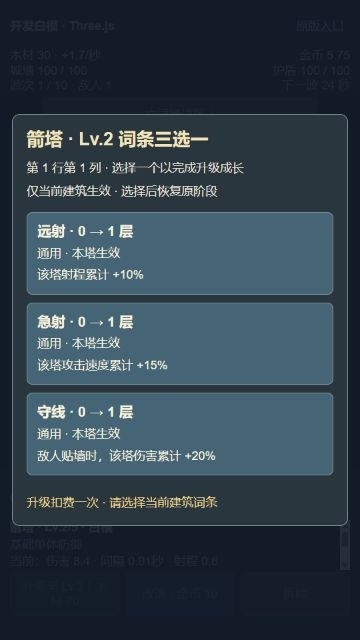
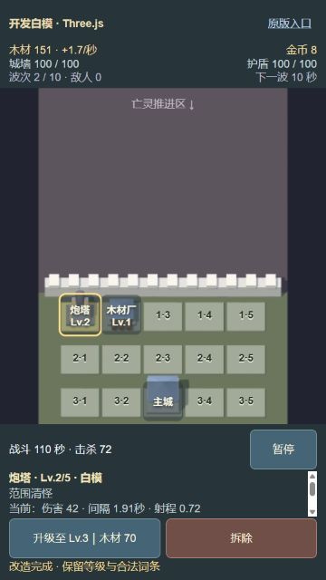
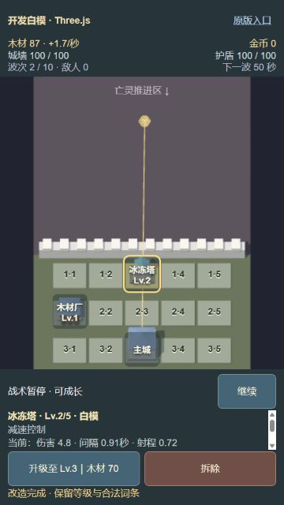
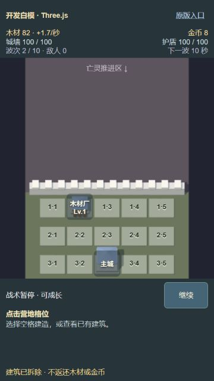

# Issue #3：3D 营地完整成长操作

日期：2026-10-09。实施分支：`codex/threejs-issue-3`，基线 `d8725535b429134ff089b6e775314ee533a501de`。本记录只覆盖开发白模的成长操作；正式资产、大厅迁移和实体设备验收仍由后续任务交付。

## 运行与实施边界

- 开发入口：`http://127.0.0.1:5183/?preview=threejs`，受管理终端 session `25123`。
- 构建产物：`http://127.0.0.1:4189/Game-ZCamp/?preview=threejs`，受管理终端 session `13464`。构建使用真实 `/Game-ZCamp/` base；原版入口链接也保留该 base。
- 固定种子 `1337`、`first_defense`、`camp_warden`。默认 `/` 仍为 Phaser，大厅点击开始战斗已实际验证。
- 只通过玩家点击、真实建造/升级/选择/改造/拆除命令与自然固定步推进取证；没有改写资源、等级、敌人、随机序列或时间。
- 应用的 `data-command-history` 是最近 64 条命令及结果的只读 DOM 证据；没有向浏览器暴露可修改的核心会话或 state handle。
- 按父规格已经确认的边界测试：GameCommand/GameState/GameEvent、一个 BattleSession、共享 UI 派生/决策、真实浏览器玩家流程。未增加 Three.js 私有模型或材质组织测试。
- 源码没有修改 `src/core` 的规则或内容数值。`src/ui/growthUi.ts` 复用原纯成长显示/决策；`src/phaser/growthUi.ts` 只保留旧逻辑像素命中与 re-export。

## 验收对应证据

| #3 要求 | 实施与验证 |
| --- | --- |
| 两种建造的用途、木材费 | 原 typed content 派生箭塔 40 / 木材厂 60。浏览器先建箭塔再建木材厂，暂停时木材为 20；本建筑产木 1/秒，顶部含主城和英雄后的总产速显示 1.7/秒。见 `lumberyard-360.jpg`、`end-to-end-commands.json`。 |
| 详情、当前/下级、费用、词条 | 情境详情内部滚动，固定底栏不会压缩格位。箭塔、炮塔和木材厂截图及原成长 UI 的 10 条回归验证属性与费用。`trait-chosen-360.jpg` 显示 Lv.2、远射 ×1、当前/下级射程。满级与本建筑累计词条文案沿用原 derive/decide 回归。 |
| 升级一次扣费、强制三选一 | 浏览器升级双击仅发一条命令；木材显示 80 → 30，Lv.2。草案无关闭/跳过/恢复按钮，HUD、场景和整个底栏同时 inert，底栏按钮也 disabled。见 `trait-draft-360.jpg`、`growth-browser-checks.json`。 |
| 草案冻结、局部效果、阶段恢复、防双选 | 冻结期间木材 30、金币 5.75、波次/敌人/战斗秒数不变；点击底栏原升级位置没有新命令。词条双击只选一次。真实流程分别恢复 TACTICAL_PAUSE、RUNNING 和 OPENING_COUNTDOWN；共享会话测试验证另一建筑没有词条。见 `end-to-end-commands.json`、`growth-browser-checks.json`、`green-opening-draft-countdown.jpg`。 |
| 四路金币改造、保留成长 | 共享 UI + 真实会话的四个参数案例各自然取得金币，改造扣 10、保留 id/格位/Lv.2/合法词条，不可再次改造。实施浏览器验证炮塔 Lv.2 留在 r1c1、保留远射；独立根 QA 自然取得 10 金币后双击改造冰冻塔，10 → 0、`growth-slot-r1-c3`/Lv.2/远射 ×1 保留。白模形状包括双管、炮管、水晶和双尖符文柱，应用/详情/选项明确标记白模。见 `cannon-transformed-360.jpg`、`root-paid-flow.json`、`root-paid-frost-360.jpg`。 |
| 不足金币仍可查看用途与费用 | 四个选项同时显示用途、金币 10 与精确差额；金币 5.75 显示还差 5 金币，点选不产生付费命令。打开改造不派发 pause，RUNNING 时木材和击杀继续自然推进。见 `gold-shortfall-360.jpg`。 |
| 确认/取消/零返还/主城 | 第一次拆除只显示确认，取消回详情；确认双击仅一条拆除。暂停时前后木材 82、金币 8 相同；模型/标签/选择被删除。主城详情无成长或拆除按钮。见 `demolition-confirm-360.jpg`、`demolished-no-model-360.jpg`、`main-city-fixed-360.jpg`。 |
| 优先级与无残留热区 | 结果 > 系统暂停 > 词条 > 改造 > 建筑。所有 handler 在当前 state 重新 derive/decide；关闭改造后选项节点数为 0，r1c3 随后可选中。原 10 条输入回归 + 新暂停/重启/改造系统暂停案例验证覆盖顺序。真实 DOM 验证词条/改造覆盖整个应用且三层下层 inert。构建产物自然失败后实测结果层三层 inert、可用格位数 0、暂停 disabled，重启清理回初始状态，见 `result-priority.json` / `result-priority.jpg`。 |
| 360×640 的 15 格及 44px 操作 | 实测 field 高 371px、footer 高 172px；15 个格位均 44×44、无相邻重叠、中心 elementFromPoint 正确，逐格点击得到对应稳定 ID。底栏按钮高 44px；词条/四改造按钮约 82.42px，关闭按钮 44px；改造 overlay 实测 360×640。见 `layout-360.json`、`growth-browser-checks.json`。 |
| 其他尺寸与构建 | 390×844、720×1280、1366×768、1440×900 测量无重叠；720 逐 15 格正确。构建子路径完成建造/升级/词条，120 → 80 → 30、Lv.2，原阶段战术暂停。见 `layouts-other-sizes.json`、`production-subpath.json`。 |

## 可复现的玩家步骤

1. 打开白模入口并暂停。选 r1c1 建造箭塔（40），选 r1c2 建造木材厂（60）。检查顶部木材 20、两种白模和对应标签；选 r1c1 点升级，得到“还差 30 木材”。
2. 继续自然战斗，木材达到 50 后再暂停。升级 r1c1：扣 50，强制三选一。等待数秒，核对木材、金币、波次/敌人与有效战斗时间冻结。点弹窗以外、底栏原按钮位置，不能派发下层命令。
3. 双击任一词条，恢复原战术暂停；查看当前建筑等级/词条与下一档属性。换选 r1c2，木材厂没有受到该塔词条影响。
4. 回到箭塔打开改造，即使金币不足也能查看四种用途与费用。点支付不起的选项只显示向上取整的差额。关闭改造，r1c3 等先前被覆盖的位置可重新选中。
5. 继续自然战斗取得至少 10 金币。打开改造期间不会自动暂停。选炮塔，扣 10 金币，r1c1 的等级、词条保留，模型与标签变为炮塔。它不再有改造入口。
6. 运行期间再升级并选择词条，选择后恢复 RUNNING。暂停后点拆除，取消回同一详情；再点拆除并确认。木材和金币都不返还，原格位成为空格，模型/标签/选中框不残留。
7. 选 r3c3，主城固定、没有升级/改造/拆除操作。可分别用新的箭塔重复四条改造；所有费用由实时内容与核心结算。
8. 快速双击“建造箭塔”：仅扣 40、仍 Lv.1。随后独立点击升级仍可用。该路径专门验证同位置按钮从建造切换为升级时的输入风险。

完整实测流程的指令、固定步号和扣费结果在 [end-to-end-commands.json](./evidence/issue-3/end-to-end-commands.json)。真实资金来自自然资源生产和击杀；截图时间不同，不把跨运行截图的木材差当成费用断言。

## 独立根 QA 复核

根会话在源码稳定后独立操作两个新验收页面，未发现新的问题，随后 reset viewport 并关闭自己的临时页面。实施代理没有通过改写核心或共享可变会话准备它的验收状态。

- 360 新开局暂停：箭塔建造双击 120 → 80 / Lv.1；升级双击 80 → 30 / Lv.2；远射双击只作用一次并返回 TACTICAL_PAUSE；首波仍显示 5 秒。见 `root-trait-360.jpg`。
- 15 格逐格选择正确，实测 44×44、overlap=[]，取消/确认双击拆除零返还、固定主城保护和零金币四路差额 10 均通过。见 `root-grid-360.json`。
- 另一轮木材厂 + 箭塔从木材 20 / +1.7 开始自然战斗，运行期间升级/远射恢复 RUNNING；真实击杀获得金币 10 后暂停，冰冻塔改造双击 10 → 0，保留建筑身份/等级/远射，木材厂无该词条。见 `root-paid-flow.json`、`root-paid-frost-360.jpg`、`root-paid-frost-720.jpg`。
- 720 和 production4189 子路径建造正常，两个新页面 console error 日志均为空。见 `root-built-production-720.jpg`。

## 发现并修复的浏览器问题

- 建造双击的第二次 click 命中刚出现的升级按钮，意外进入草案并多扣 50。红阶段截图 `red-build-doubleclick-upgrades.jpg`；在 HTML 输入边界忽略同一 multi-click 手势的后续 click 后，`green-build-doubleclick-360.jpg` 实测 120 → 80、Lv.1，一条建造命令。后续独立升级已验证。
- 开局未暂停直接升级时，TRAIT_DRAFT 的首波信息误显示“下一波 60 秒”。红/绿截图 `red-opening-draft-countdown.jpg` / `green-opening-draft-countdown.jpg`。共享 `deriveGrowthWaveTime` 同时读取草案 returnPhase，直接草案和嵌套系统暂停的公开测试均显示真实冻结首波时间。
- 1366×768 矮桌面窗口按宽度切换成 64px 格位后，横向相邻热区重叠。红截图 `red-wide-slot-overlap.jpg` 与原测量；大标签样式增加高度条件，矮视口保留 44px，绿色测量 field 497.9px、无重叠。见 `green-wide-no-overlap.jpg`。

## 自动检查与测量边界

- `npm run check`：15 个测试文件、125 项通过，包含新增共享 UI/真实会话的 9 项案例；`npm run build`：通过。构建仅有既有体积警告，Phaser 默认入口仍保留在对照版本中。
- TDD 失败输出与绿色结果见 [TDD_LOG.md](./evidence/issue-3/TDD_LOG.md)。现有核心成长、战斗、经济和旧 UI 命中回归全部通过。
- 实际浏览器 UA：Chrome/155.0.0.0、Windows NT 10.0，renderer pixel ratio 1.5；这是桌面隐藏 IAB 的视口测试，不是实体手机。实际 OS/浏览器性能能力不能仅由 UA 推断。
- 稳定源码的默认大厅→战斗及构建入口没有新 console error。实施期间删/重建源码文件产生的临时 HMR fetch 错误已消除，不把历史日志误报为最终运行错误。
- 真实 OS 后台切换/原生焦点控制未在此隐藏 IAB 中实测。系统暂停保存草案、原阶段恢复、重启和结果优先级由公开会话/共享输入回归与实际 DOM 共用覆盖逻辑验证；实体设备和真实后台仍须在 #5/#13 记录。
- 结束前恢复了临时浏览器 viewport；服务按根 QA 的交接要求保留，根验收完成后再清理，不另起孤儿后台进程。

关键截图：

