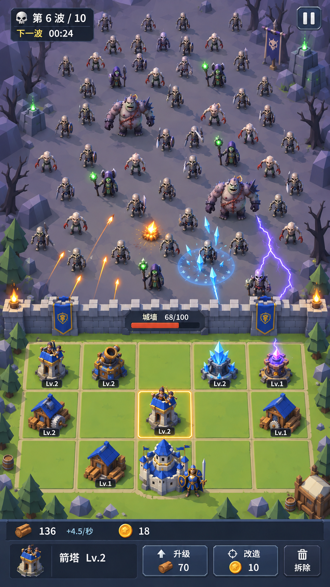

# ZCamp Three.js 风格化低模改造规格

日期：2026-10-09

状态：待实施规格

追踪：[GitHub Issue 1](https://github.com/sumo91/Game-ZCamp/issues/1)

适用基线：当前仓库提交 b8637996d54d2bb523f5a8375c4157f58a94b219

将《尸潮营地》的 Phaser 图元表现迁移为 Three.js 实时 3D，采用受《魔兽争霸3》启发的原创人类堡垒与亡灵题材、风格化低模资产和固定俯视构图。保留现有三英雄、三关卡、建筑成长、资源经济和战斗规则，先完成可玩的美术样板，再扩充为完整版本。

## Problem Statement

玩家希望城墙、营地、建筑与不断逼近的尸群组成一个有体积、有材质层次、能够辨认单位和战斗效果的微缩世界。当前图元表现能够说明玩法，但建筑、英雄、敌人和环境的形象与所提供参考图有明显差距，难以传达奇幻堡垒抵御亡灵的题材和美术完成度。

本次改造需要在提高表现质量的同时保留经营与防守体验：15 个营地格位始终清楚可点，建筑成长决策便捷，尸潮威胁明确，手机上的文字、触控和高密度战斗可用。玩家不应因渲染技术迁移而失去已有进度，或遇到不同的价格、波次、攻击结果和暂停行为。

## Solution

提供一个由 Three.js 渲染的实时 3D 战场，配合 HTML/CSS 的中文界面。固定高俯角正交镜头下，上方为紫灰色亡灵推进区，中间为横向城墙，下方为绿色的 5×3 营地。蓝金色人类建筑与紫灰、幽绿色亡灵形成阵营区分，角色和建筑采用夸张比例、厚实轮廓、受控高光及稳定接地阴影。

玩家沿用既有流程：选择英雄与关卡，进入战斗，消耗木材建造和升级，升级后选择该建筑的词条，消耗金币把箭塔改造成特殊塔，在战术暂停中规划，最终获得胜负结果与既有解锁奖励。

完整交付包含三英雄、三关卡、五种攻击塔、木材厂、主城、七种敌人、城墙、环境、攻击与状态特效、大厅和全部操作界面。美术样板是中间验收阶段，不代表完整迁移完成。

## User Stories

1. As a 首次进入游戏的玩家, I want 看到原创人类堡垒抵御亡灵的统一题材, so that 我能立即理解阵营和防守目标。
2. As a 玩家, I want 城墙、建筑和单位具有真实 3D 体积及接地阴影, so that 战场像一个完整的微缩世界。
3. As a 玩家, I want 使用稳定的固定俯视镜头, so that 我能持续观察尸潮和营地并准确操作。
4. As a 手机玩家, I want 15 个营地格位完整可见且可点, so that 我不会因为屏幕尺寸失去可用建造位置。
5. As a 玩家, I want 清楚区分尸潮区、城墙和营地, so that 我能判断进攻方向及防线位置。
6. As a 玩家, I want 通过轮廓、比例和装备分辨敌人, so that 我无需依赖细小文字或单一颜色判断威胁。
7. As a 玩家, I want 精英和 Boss 在群体中具有明显体型与招牌动作, so that 我能及时发现高威胁目标。
8. As a 玩家, I want 普通敌人的行走相位和外观有克制的变化, so that 尸群自然且仍然清楚可读。
9. As a 玩家, I want 五种攻击塔具有不同的顶部造型和攻击反馈, so that 我能快速识别防守配置。
10. As a 玩家, I want 建筑升级后等级信息和外观成长都清楚可见, so that 我能辨认投入带来的成长。
11. As a 玩家, I want 选中的格位或建筑具有清楚的高亮, so that 我知道当前操作对象。
12. As a 玩家, I want 点击空格后看到箭塔与木材厂的用途、资源和实际费用, so that 我能做出建造决定。
13. As a 玩家, I want 成功建造后建筑在正确格位出现并获得反馈, so that 我能确认操作已生效。
14. As a 玩家, I want 点击建筑后看到真实等级、属性、产出与已有词条, so that 我能判断下一次投入。
15. As a 玩家, I want 使用木材升级建筑且只扣除一次费用, so that 成长结果与既有规则一致。
16. As a 玩家, I want 升级后的词条三选一冻结战斗并作用于当前建筑, so that 我能从容规划该建筑的成长。
17. As a 玩家, I want 选择词条后恢复升级前对应的运行或暂停状态, so that 操作不会意外改变战斗节奏。
18. As a 玩家, I want 查看四种特殊塔的用途和金币费用, so that 我能选择箭塔的改造方向。
19. As a 玩家, I want 改造后保留格位、等级和按既有规则保留的词条, so that 我的既有投入不会丢失。
20. As a 玩家, I want 资源不足、满级或操作不可用时得到准确原因, so that 我能理解下一步需要什么。
21. As a 玩家, I want 拆除按既有确认与零返还规则执行, so that 高风险操作不会因界面迁移改变结果。
22. As a 玩家, I want 主城固定存在且不被当成普通可拆建筑, so that 营地核心始终明确。
23. As a 玩家, I want 木材、木材产速、金币、城墙耐久和护盾显示真实数据, so that 我能依据界面判断局势。
24. As a 玩家, I want 看到真实波次、下一波时间和首波倒计时, so that 我能安排成长决策。
25. As a 玩家, I want 炮击、寒霜、雷电和速射有不同反馈, so that 我能理解不同塔种的作用。
26. As a 玩家, I want 命中、燃烧、减速、死亡和奖励反馈与战斗结果一致, so that 我不会被装饰效果误导。
27. As a 玩家, I want 冲锋预警、冲锋与君王鼓舞清楚可辨, so that Boss 能力具有可读的威胁表达。
28. As a 玩家, I want 战术暂停冻结战斗与资源推进但允许既有建造操作, so that 我能安心规划防线。
29. As a 玩家, I want 切到后台后游戏系统暂停且返回时不补算后台战斗, so that 我的防线不会在不可操作时被攻破。
30. As a 玩家, I want 弹窗和结算面板阻止点击穿透, so that 确认选项时不会误操作营地。
31. As a 玩家, I want 清楚看到城墙受击、低耐久和失败反馈, so that 我能理解防线的危险状态。
32. As a 玩家, I want 胜利和失败时战斗停止且结算正确, so that 我能可靠地重试或返回大厅。
33. As a 玩家, I want 在大厅继续选择既有三名英雄和三个关卡, so that 我的选择和解锁路径得到保留。
34. As a 回归玩家, I want 已解锁英雄、关卡和最近选择继续有效, so that 技术升级不会清空进度。
35. As a 玩家, I want 关卡仍然按十波、十二波、十五波的既有配置运行, so that 原有难度和挑战结构保持一致。
36. As a 手机玩家, I want 文字清楚、按钮可触达且适配安全区域, so that 我能在小屏幕上准确操作。
37. As a 玩家, I want 窗口尺寸变化后画面、标签和点击位置仍然一致, so that 我不会点到错误建筑。
38. As a 使用较低性能设备的玩家, I want 降低画质后仍然保留单位、关键预警和准确规则, so that 我能流畅完成战斗。
39. As a 玩家, I want 高密度尸群与持续攻击下仍然可操作, so that 后期战斗不会因为画面复杂而失去响应。
40. As a 玩家, I want 加载过程提供明确状态并在失败后可重试, so that 我不会停留在无反馈的空白页面。
41. As a 玩家, I want 静音设置与首次交互后的声音播放正常, so that 声音行为符合我的选择和浏览器限制。
42. As a 玩家, I want 连续重试或返回大厅后没有重复声音、动画和输入, so that 游戏长期运行仍然稳定。
43. As a 美术制作者, I want 统一的模型尺寸、朝向、锚点、材质与动画约定, so that 新资产可以稳定接入并保持风格一致。
44. As a 开发者, I want 表现资产与玩法数据分开配置, so that 更换模型和题材不会改变战斗数值。
45. As a 验收者, I want 用可复现的玩家流程、参考截图和设备性能记录判断交付, so that 美术迁移是否完成具有明确依据。

## Implementation Decisions

### 玩法基线与范围

- 本次定义渲染、美术与界面迁移。核心模拟继续保持平台无关、确定性和数据驱动；渲染器、浏览器、DOM、声音及资产加载保持在边界。
- 以适用基线中的运行内容和对应回归测试冻结规则。已有历史文档中仅第一关的十波说明，不缩减当前三关分别十波、十二波、十五波的内容。
- 保留 5 秒开局倒计时、既有波次时间轴及脉冲组成、木材建造与升级、金币改造、词条池、等级上限、价格、敌人属性、英雄加成、城墙与护盾、胜负及解锁规则。
- 保留 5×3 网格、稳定格位标识及第三行第三列的固定主城。其余十四个格位遵循现有占用与建造规则。
- 保留既有一维推进、寻敌、射程、范围伤害及稳定排序规则。显示位置不参与命中计算，不添加单位碰撞、地形阻挡或寻路。
- 参考图中的第六波、24 秒、资源数值、等级、费用和耐久属于示例展示，不是运行参数。

### 技术栈与模块边界

- 使用 TypeScript、Vite、Three.js、HTML/CSS 和 Vitest。首版采用 WebGL 渲染路径；完整迁移完成时移除生产运行对 Phaser 的依赖。
- 核心通过既有 GameCommand 接收操作，通过 GameState 与 GameEvent 提供结果。表现层不得直接写入正式游戏状态，不得通过模型碰撞或动画结束决定伤害。
- 建立一个战斗会话边界，统一负责命令派发、模拟推进、事件交付和场景生命周期。Three.js 战场与界面共享该会话，不各自持有第二套玩法状态。
- 拆分 Three.js 战场、大厅展示、资产目录、模型实例管理、动画与特效、镜头与坐标、界面呈现等职责。模块名称与落点由实施时的仓库结构决定。
- 复用现有成长与大厅显示数据、输入优先级、反馈分类、进度存储及声音能力；把屏幕坐标和引擎对象从可复用逻辑中抽离。
- 通过类型化表现目录关联内容 ID 与模型、材质、比例、动画、攻击锚点、等级附件、名称及特效。加载前校验覆盖范围与必要字段，不在场景分支中散落资产配置。
- 保留既有进度存储键与稳定英雄、关卡及建筑 ID。显示名称和资产变化不触发重置；若确有结构迁移需要，提供向后兼容和可验证的迁移规则。

### 时间与生命周期

- 接入已有固定步时钟，默认每步 1/30 秒，保留有限追帧工作量；渲染可在更高帧率下插值。显示随机变化使用独立的可复现来源，不消费玩法随机序列。
- 按固定模拟步编号派发命令，允许用同一种子和同一命令序列复现结果。不同显示帧率下，对比相同模拟步数的状态；被追帧上限截断的墙钟时间不作为等价条件。
- 战术暂停、词条选择、系统暂停和终局时，停止战斗模拟与相关战斗动画推进。界面过渡可继续；保留当前各阶段允许的操作及恢复语义。
- 进入后台立即系统暂停，停止追帧；恢复时清除时钟积压，不补算后台时间，不擅自解除原有战术暂停或词条选择。
- 重试、返回大厅和场景销毁释放或回收模型实例、动画状态、监听器与特效。共享资产采用明确所有权，避免释放仍在使用的资源；最终退出时释放 GPU 资源。

### 镜头布局与输入

- 保留 720×1280 的竖屏设计基准，使用固定高俯角正交镜头及接近左右对称的正面构图，不开放自由旋转和缩放。
- 将敌人推进进度映射到地面纵轴，横向显示分布及小幅错位由稳定 ID 决定。避免夸张摆动造成越墙或与命中效果脱节。
- 尸潮区占主要画面，城墙形成唯一清楚的横向失败锚点，营地完整显示 15 格。建筑、树木和岩石不得遮挡可操作格位及关键预警。
- Three.js 负责战场和模型，HTML/CSS 负责资源、波次、时间、操作按钮、大厅卡片、词条、改造与结算。建筑等级等少量对象标签通过统一的世界到屏幕投影定位。
- 底部情境操作栏根据所选对象显示真实可用操作。建造、升级、改造和拆除的名称、资源、费用、不可用原因来自内容与显示数据；不新增另一套资源结算。
- 使用独立格位或简化建筑选取区域处理射线点击。点击标签也应选中同一对象，装饰物不抢占选取；完成一次点击最多派发一条对应命令。
- 沿用结果、系统暂停、词条、改造、普通建筑操作的现有输入优先级。覆盖层和按钮阻止事件落入场景，不将不可见按钮区域保留为可点击区域。
- 在 360×640、390×844、720×1280 及桌面宽屏验证布局，处理设备安全区域和页面缩放。主要操作热区目标不少于 44 CSS 像素，不能仅以逻辑画布尺寸判定。

### 题材与美术

- 采用受《魔兽争霸3》启发的原创人类与亡灵题材。人类建筑使用蓝顶、石质基座、金色装饰和木材结构；亡灵使用紫灰环境、残破装备及受控的幽绿光源，设计原创徽记与角色。
- 厚实轮廓、夸张武器和比例先于纹理细节；建筑与角色有倒角、材质分色、柔和表面明暗及接地阴影。岩石和外围地形允许切面表达，不把所有模型统一处理成硬边纯色几何块。
- 采用温暖、可经营的营地与冷色威胁区对比，中央地面保持可读明度。火、冰、电具有不同功能色与形状，颜色之外仍保留轮廓和动作区分。
- 当前五种攻击塔、木材厂及主城构成七个建筑家族。共用底座和结构部件，攻击部分、装饰、等级附件及发射点体现功能差异；各等级仍显示准确数字，至少提供低、中、高三级可辨外观成长。
- 当前七种敌人全部提供可辨资产，允许共用骨架与身体。普通单位至少有行走、攻墙、受击和死亡反馈；两个 Boss 增加冲锋与鼓舞所需的专属表达。
- 三名英雄保留原有驻守及加成职责，提供与大厅一致的战场形象，不增加玩家直接控制或新技能。

| 稳定内容身份 | 默认视觉表达 | 规则边界 |
| --- | --- | --- |
| arrow_tower | 蓝金色箭塔与弓手 | 保留基础单体攻击 |
| machine_gun | 连弩塔与速射机构 | 保留既有速射及穿透；名称和描述按奇幻题材同步 |
| cannon | 石质火炮塔 | 保留范围伤害与燃烧 |
| frost | 寒霜水晶塔 | 保留减速与既有词条效果 |
| electric | 雷电符文塔 | 保留链式攻击与既有词条效果 |
| lumberyard | 蓝顶木材厂 | 保留生产、费用与成长 |
| main_city | 蓝顶人类堡垒 | 保留固定位置和既有不可拆规则 |
| walker / runner / tank | 骷髅步兵 / 食尸鬼 / 重装亡者 | 保留基础推进、高速突破、高生命职责 |
| armored / brute | 亡灵卫士 / 攻城巨尸 | 保留减伤与高额攻墙职责 |
| charger_boss / overlord_boss | 冲锋领主 / 亡灵君王 | 保留冲锋与鼓舞能力 |
| camp_warden / vanguard_gunner / lumber_baron | 堡垒守望者 / 连弩卫士 / 采伐领主 | 保留既有英雄属性及解锁条件 |

- 以上题材名称进入独立表现目录并在大厅、详情、提示与词条说明中一致使用。内容 ID 不改名。参考图的披袍持杖单位可作为外观变体，不据此添加远程施法规则。

### 资产与战斗效果

- 建模及动画采用 Blender 等可输出 glTF 的制作工具，交付运行资产采用 GLB。程序生成几何用于白模与可控的模块化物件，完整版本使用达到样板标准的资产。
- 统一地面尺寸、脚底或基座原点、朝向、缩放、武器发射点和受击锚点。资产目录明确必要动画或等价程序动画；常用语义为 idle、walk、attack、hit、death，Boss 增加专属语义。
- 烘焙环境遮蔽与材质明暗帮助保持体积；以一盏主要投影方向光为实时阴影基础。小怪可使用简化接地阴影，低画质保留可辨的接地效果。
- 静态重复场景元素按几何与材质进行实例化。带独立骨骼动画的群体须使用经验证的方案，不把普通 InstancedMesh 视为现成的独立骨骼动画解决方案。
- 先测试简化骨骼或分件动画；美术样板实测不达性能目标时，再采用动画烘焙或专门的群体渲染。普通敌人实例化方案由性能证据决定。
- 事件驱动开火、命中、死亡、金币飞行、升级及改造反馈；保留表现缓存中的最后锚点，允许核心已移除目标时完成短暂死亡与命中特效。反馈不改变结算顺序，不重复播放奖励或音效。
- 箭矢与弹道仅展示既有即时结算。通过短飞行时间及及时的受击反馈减少视觉错位；不等待弹道到达再扣血。
- 关键预警、冲锋、鼓舞和城墙受击在低画质中仍保留。减少透明粒子和大面积发光叠加，重击数字与环境提示沿用已有节流意图。
- 资产加载提供可理解的进度状态、失败说明和重试入口。正式入口不得在模型缺失时悄然以白模冒充完成资产；开发占位有明确标记。
- 相对部署基址解析模型、纹理和解码资源，确保本地及仓库子路径网页部署均可运行。首批战斗资产就绪后进入战斗，其余内容可分批加载。

### 交付阶段与完成条件

| 阶段 | 交付内容 | 阶段完成条件 |
| --- | --- | --- |
| A 3D 白模 | 战斗会话、镜头、城墙、15 格、敌人推进、基础界面及建造选取 | 命令和状态贯通，点击正确，暂停语义正确，规则基线可复现 |
| B 美术样板 | 精修箭塔、木材厂、主城、城墙、一种普通敌人、基础环境、攻击及受击效果 | 通过建造、升级、词条、暂停恢复的可玩流程；真机记录表现及群体性能；确定可复用美术标准 |
| C 完整迁移 | 全部建筑、七种敌人、三英雄、三关卡、大厅、改造、结算、进度和声音 | 全部正式内容有资产覆盖，完整玩家流程无 Phaser 生产依赖，核心回归通过 |
| D 网页候选验收 | 手机适配、画质档位、加载失败、后台切换、长期生命周期及部署 | 完成下列功能、美术及性能验收，已知问题和设备证据可追溯 |

- B 阶段需在固定游戏镜头内确认比例、材质、光照、单位大小、UI 和特效清晰度。达到该样板后扩充资产，不能用建模工具近景替代运行画面验收。
- A、B 阶段允许保留可回退的旧入口供对照。C、D 完成后默认入口为 Three.js，旧表现不再构成生产依赖。
- 验收记录中的具体模型三角数、材质数、绘制调用、下载体积与像素密度以样板实测登记并形成预算。预算用于解释性能，不代替实际帧耗时与用户操作验证。

## Testing Decisions

### 首选测试边界

- 使用既有 GameSimulation 的 GameCommand、GameState、GameEvent 作为规则验证接口；浏览器层从正式大厅和玩家操作验证完整体验。仅新增一个高层战斗会话测试边界，复用核心公开接口，不为模型工厂、私有渲染方法或每个资产各建一套模拟接口。
- 好的测试证明外部行为：操作是否生效、费用是否准确、暂停是否冻结、同一输入是否产生同一结果、模型是否正确可见、点击是否选择正确对象。避免断言 Three.js 内部对象组织、私有方法调用顺序、固定材质数量或动画实现方式。
- 本规格默认采用以上测试边界和验收方案。项目所有者提出调整时更新规格；实施不得因便利降低玩家流程覆盖。

### 核心与会话回归

- 保留固定步时钟、种子随机、内容校验、成长核心、战斗与经济集成、英雄和解锁的既有 Vitest 测试。
- 现有成长集成测试中的建造、墙边目标攻击、局部词条、特殊塔、资源扣费与暂停恢复，为迁移测试提供先例；现有成长界面与大厅测试继续验证显示数据及决策规则。
- 对基线核心和迁移后的会话输入同一种子、关卡、英雄及按固定步登记的命令序列，对比关键状态和事件。不得将旧 Phaser 的可变帧时间推进与新固定步推进的相同墙钟秒数误判为必须逐事件一致。
- 以不同显示帧率驱动到相同模拟步数，对比资源、敌人状态、伤害、词条、波次和终局。故意制造长帧时验证有限追帧，后台恢复验证无补算。
- 验证重复点击最多结算一次，动画播放速度、模型位置和画质变化均不改变规则。验证战术暂停内允许的建造与词条选择后的返回阶段。

### 浏览器玩家流程

- 覆盖大厅选择、锁定提示、出战、十四个空格选取、建造、升级、词条选择、四种改造、拆除确认、取消、满级及资源不足。
- 覆盖开局倒计时、战术暂停、系统暂停、后台返回、词条期间系统暂停、结果覆盖层与点击穿透。冻结期间木材、敌人和有效战斗时间不推进，恢复行为保持既有语义。
- 覆盖三关正确波数与 Boss 能力、胜利解锁、失败重试、返回大厅、刷新后进度与最近选择；验证旧版本存储样本可读取。
- 记录固定种子、指令或操作步骤、画布尺寸、浏览器版本及结果截图。开发场景可以缩短取证时间，但至少完成一次正式入口完整胜负与持久化流程，不只依赖演示模式。
- 对比桌面与手机尺寸下建筑选取、等级标签投影、底部按钮、安全区域及弹窗。窗口调整后点击位置必须与可见格位一致。
- 验证加载失败与重试、子路径静态部署、静音、首次交互声音解锁。部署检查使用构建产物，不以开发服务器正常代替。

### 美术验收

- 在开局营地、普通尸群、精英混编、双 Boss、高密度攻击、建筑升级、词条和改造等状态截取运行画面，与附带参考图和 B 阶段确认样板比较。
- 15 格可数、建筑类型和所选对象可辨；普通、精英及 Boss 有轮廓差异；蓝金营地与紫灰亡灵区形成清楚对比；模型有体积与稳定接地效果。
- 必要动作没有持续穿地、漂浮和明显错位；关键攻击反馈对应真实目标或缓存锚点，冰、电、火不会淹没敌人和城墙。
- 完整版不得遗留未标记白模、缺失资产、错误题材描述或仅靠换色区分全部内容。美术质量由实际游戏镜头验收，像素截图差异不是唯一判断标准。

### 性能与生命周期验收

- B 阶段登记实际测试设备、系统、浏览器、画质、视口及像素密度，至少包含一台实体中档手机和一台桌面设备。设备清单和运行参数进入后续验收记录；目标为测量标准，不构成全设备性能承诺。
- 分别构造 100、200、300 个同时活动的单位场景，包含普通、精英与两种 Boss，配合 15 格建筑和持续攻击。记录单位类型与数量、CPU/GPU 可获取指标、绘制调用和三角数，不用单波刷出数量代替同时活动数量。
- 在登记的中档手机适配画质下，200 个活动单位压力场景连续运行 5 分钟，目标帧间隔中位数不高于 33.3 ms、P95 不高于 50 ms，并验证操作持续响应。
- 在登记的桌面设备标准画质下，同场景目标帧间隔中位数不高于 16.7 ms、P95 不高于 25 ms。300 单位场景用于识别容量与退化点，须持续可操作、无崩溃、无规则丢失；不预设其必须达到同档帧率。
- 画质降低可减少分辨率、阴影精度、模型细节和装饰特效，不删除核心敌人、减少战斗数量或省略关键预警来满足性能目标。
- 完成至少十次大厅、战斗、重试、返回循环，验证监听器、音效、动画及特效不重复；JS/GPU 资源指标在预热后不持续单调增长。记录共享缓存和浏览器内存统计的边界，不能只凭单次内存值宣称无泄漏。
- 实际三关后期也应记录峰值活动单位并回归，确保人工压力场景没有遗漏真实内容组合。

## Out of Scope

- 重写或重新平衡战斗核心，包括新增二维射程、真实碰撞、单位阻挡、寻路或地形战术。
- 改变价格、资源职责、波次组成、英雄加成、敌人属性、Boss 能力、词条池、等级上限、胜负或解锁路径。
- 因参考图出现持杖角色而新增远程施法、召唤或治疗敌人；新增种族、关卡、英雄、建筑或商业化系统。
- 将游戏改为即时战略，加入英雄直接控制、可旋转镜头、自由建造、大地图或联网对战。
- 使用《魔兽争霸3》的原始模型、纹理、角色、徽记或 UI 资产。此处采用原创题材表达与风格启发。
- 首版实现 WebGPU 专用渲染、复杂全局光照、全屏高成本后处理或物理驱动破坏。
- 微信小游戏、其他小程序或原生应用的适配与认证。当前交付目标为桌面及移动浏览器网页，其他平台另行立项。
- 自动购买素材、发布网站、修改项目协作角色或派发跨聊天任务。规格发布与后续开发、上线分别处理。

## Further Notes

- 本次参考图用于构图、比例、配色、材质层次和界面信息的验收方向。最终运行画面受实时动画、设备预算和实际内容影响，不要求逐像素复刻静态图。
- 旧美术与 UI 规范中关于 Phaser、图元制作和旧视觉主题的条款由本次方向替代；仍适用的可读性、输入、资源显示及冻结规则保留。实施阶段同步更新正式美术和界面规范，不让多份文档形成矛盾事实源。
- 资产制作与程序接入应共同使用 B 阶段确认的运行样板。模型来源、可编辑源文件、动画及材质交付范围需随资产清单记录。
- 预计由一名熟悉 Three.js 的开发配合一名风格化美术制作：白模数个工作日，美术样板约 1–2 周，完整首版可按 4–8 周粗估。该估算以可持续的资产制作支持为前提，不作为验收条件或工期承诺。
- 规格在 sumo91/Game-ZCamp 的 GitHub Issues 追踪，使用 ready-for-agent 分流标签。测试边界按本规格默认方案执行；参考图副本随本地规格保存。
- Three.js 官方实现依据：[正交相机](https://threejs.org/docs/pages/OrthographicCamera.html)、[GLB 加载](https://threejs.org/docs/pages/GLTFLoader.html)、[静态实例化](https://threejs.org/docs/pages/InstancedMesh.html)、[骨骼模型](https://threejs.org/docs/pages/SkinnedMesh.html)、[动画系统](https://threejs.org/manual/pages/animation-system.html)、[阴影与成本](https://threejs.org/manual/pages/shadows.html)。具体版本在实施时锁定并与上述能力核对。

参考图附件：

