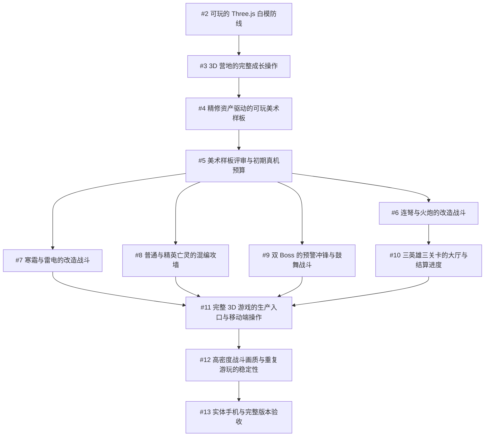

# ZCamp Three.js 改造任务清单

日期：2026-10-09

状态：经项目所有者确认，12 个子任务已发布至 GitHub Issues。发布时全部开放。

父规格：[Issue #1：ZCamp Three.js 风格化低模改造规格](https://github.com/sumo91/Game-ZCamp/issues/1)

所有子任务已建立 GitHub 原生父子及阻塞关系。10 个任务标记 ready-for-agent，[#5](https://github.com/sumo91/Game-ZCamp/issues/5) 和 [#13](https://github.com/sumo91/Game-ZCamp/issues/13) 标记 ready-for-human。两个人工节点需完成项目所有者接受记录及实体设备取证后关闭，自动测试通过不能代替人工验收。

先在 [#2](https://github.com/sumo91/Game-ZCamp/issues/2) 完成会话抽取和现有入口回归，再接入最小 3D 白模。[#4](https://github.com/sumo91/Game-ZCamp/issues/4) 的样板经 [#5](https://github.com/sumo91/Game-ZCamp/issues/5) 接受后扩充资产；[#6](https://github.com/sumo91/Game-ZCamp/issues/6)、[#7](https://github.com/sumo91/Game-ZCamp/issues/7)、[#8](https://github.com/sumo91/Game-ZCamp/issues/8)、[#9](https://github.com/sumo91/Game-ZCamp/issues/9) 可从已接受的样板开展。[#10](https://github.com/sumo91/Game-ZCamp/issues/10) 复用 [#6](https://github.com/sumo91/Game-ZCamp/issues/6) 的速射表现，[#11](https://github.com/sumo91/Game-ZCamp/issues/11) 汇合完整内容，[#12](https://github.com/sumo91/Game-ZCamp/issues/12) 验证高密度战斗与生命周期，[#13](https://github.com/sumo91/Game-ZCamp/issues/13) 完成实体设备及产品验收。

参考图已上传至 [#4 精修资产驱动的可玩美术样板](https://github.com/sumo91/Game-ZCamp/issues/4)，本地副本仍随规格保存。父规格正文、标题、标签和开放状态经发布后核对保持原样。

## 任务概览

| GitHub Issue | 标题 | 阻塞于 | 分流标签 |
| --- | --- | --- | --- |
| [#2](https://github.com/sumo91/Game-ZCamp/issues/2) | 可玩的 Three.js 白模防线 | 无，可立即开始 | ready-for-agent |
| [#3](https://github.com/sumo91/Game-ZCamp/issues/3) | 3D 营地的完整成长操作 | [#2](https://github.com/sumo91/Game-ZCamp/issues/2) | ready-for-agent |
| [#4](https://github.com/sumo91/Game-ZCamp/issues/4) | 精修资产驱动的可玩美术样板 | [#3](https://github.com/sumo91/Game-ZCamp/issues/3) | ready-for-agent |
| [#5](https://github.com/sumo91/Game-ZCamp/issues/5) | 美术样板评审与初期真机预算 | [#4](https://github.com/sumo91/Game-ZCamp/issues/4) | ready-for-human |
| [#6](https://github.com/sumo91/Game-ZCamp/issues/6) | 连弩与火炮的改造战斗 | [#5](https://github.com/sumo91/Game-ZCamp/issues/5) | ready-for-agent |
| [#7](https://github.com/sumo91/Game-ZCamp/issues/7) | 寒霜与雷电的改造战斗 | [#5](https://github.com/sumo91/Game-ZCamp/issues/5) | ready-for-agent |
| [#8](https://github.com/sumo91/Game-ZCamp/issues/8) | 普通与精英亡灵的混编攻墙 | [#5](https://github.com/sumo91/Game-ZCamp/issues/5) | ready-for-agent |
| [#9](https://github.com/sumo91/Game-ZCamp/issues/9) | 双 Boss 的预警冲锋与鼓舞战斗 | [#5](https://github.com/sumo91/Game-ZCamp/issues/5) | ready-for-agent |
| [#10](https://github.com/sumo91/Game-ZCamp/issues/10) | 三英雄三关卡的大厅与结算进度 | [#6](https://github.com/sumo91/Game-ZCamp/issues/6) | ready-for-agent |
| [#11](https://github.com/sumo91/Game-ZCamp/issues/11) | 完整 3D 游戏的生产入口与移动端操作 | [#7](https://github.com/sumo91/Game-ZCamp/issues/7)、[#8](https://github.com/sumo91/Game-ZCamp/issues/8)、[#9](https://github.com/sumo91/Game-ZCamp/issues/9)、[#10](https://github.com/sumo91/Game-ZCamp/issues/10) | ready-for-agent |
| [#12](https://github.com/sumo91/Game-ZCamp/issues/12) | 高密度战斗画质与重复游玩的稳定性 | [#11](https://github.com/sumo91/Game-ZCamp/issues/11) | ready-for-agent |
| [#13](https://github.com/sumo91/Game-ZCamp/issues/13) | 实体手机与完整版本验收 | [#12](https://github.com/sumo91/Game-ZCamp/issues/12) | ready-for-human |

## 依赖关系

## 子任务内容

### #2 可玩的 Three.js 白模防线

GitHub：[#2 可玩的 Three.js 白模防线](https://github.com/sumo91/Game-ZCamp/issues/2)

阻塞于：无，可立即开始。

分流标签：ready-for-agent

覆盖父规格用户故事编号：3、4、5、11、12、13、22、23、24、28、29、44。

玩家通过开发预览进入固定俯视的 3D 战场，在空格建造箭塔，看到敌人推进、被击杀或攻墙，能够暂停与恢复；同一套核心规则继续支持原有 Phaser 入口。

验收标准：

- [ ] 先抽取统一战斗会话并接入既有入口，再新增 Three.js 预览；命令、状态和事件复用既有核心，正式表现不直接写入模拟状态。
- [ ] 正交镜头下显示 5×3 共 15 格，第三行第三列为固定主城；14 个空格可准确选取，装饰不抢占点击。
- [ ] HTML/CSS 显示真实木材、金币、城墙耐久与护盾、波次和倒计时；点击建造箭塔只派发一次命令，费用按现有内容结算。
- [ ] 白模敌人按既有推进状态移动，箭塔攻击、命中、死亡、金币奖励和攻墙均可见；横向显示分布不参与射程与伤害。
- [ ] 新入口使用已有固定步时钟，默认 1/30 秒并限制追帧；战术和系统暂停冻结战斗与资源，后台返回无补算。
- [ ] 保留原有正式入口可用；新入口明确标记开发白模，避免把未完成美术作为正式完成品。
- [ ] 既有核心回归通过；新增高层会话行为验证覆盖同一种子及命令序列、重复点击、暂停恢复，并留存 360×640 与 720×1280 的最小战斗截图。

### #3 3D 营地的完整成长操作

GitHub：[#3 3D 营地的完整成长操作](https://github.com/sumo91/Game-ZCamp/issues/3)

阻塞于：[#2 可玩的 Three.js 白模防线](https://github.com/sumo91/Game-ZCamp/issues/2)。

分流标签：ready-for-agent

覆盖父规格用户故事编号：4、11、12、13、14、15、16、17、18、19、20、21、22、23、28、30、36。

玩家在 3D 营地建造箭塔和木材厂，升级并选择词条，将箭塔改造成四种特殊塔，确认拆除；界面和白模准确反映资源、等级及操作状态。

验收标准：

- [ ] 空格提供箭塔与木材厂的真实用途和木材费用；已建对象显示真实属性、产速、等级、词条及升级费用。
- [ ] 升级只扣费一次并冻结为三选一；选择仅作用于当前建筑，返回原运行或战术暂停状态，双击不能重复选择。
- [ ] 四条改造路径通过既有金币命令生效，保留原格位、等级与规则允许的词条；特殊塔暂用明确标记的白模区分。
- [ ] 拆除遵循原有确认、取消和零返还规则；主城固定且不能拆除。资源不足、满级和非法操作显示准确原因。
- [ ] 词条、改造、系统暂停与结果覆盖层按现有优先级阻断场景点击；不可见操作不遗留点击热区。
- [ ] 360×640 视口下 15 格完整可点，主要操作热区目标不少于 44 CSS 像素，选中对象与等级标签定位一致。
- [ ] 复用成长显示数据与决策逻辑的行为测试；提供建造→升级→词条→改造→拆除的浏览器复现步骤与截图，不新增或改变玩法数值。

### #4 精修资产驱动的可玩美术样板

GitHub：[#4 精修资产驱动的可玩美术样板](https://github.com/sumo91/Game-ZCamp/issues/4)

阻塞于：[#3 3D 营地的完整成长操作](https://github.com/sumo91/Game-ZCamp/issues/3)。

分流标签：ready-for-agent

覆盖父规格用户故事编号：1、2、5、6、8、9、10、13、25、26、40、43、44。

玩家在真实游戏镜头下看到蓝金色箭塔、木材厂、主城与城墙，对抗有动作和阴影的骷髅步兵；建造、升级、词条和战斗在同一个精修样板中运行。

验收标准：

- [ ] 交付箭塔、木材厂、主城、城墙、骷髅步兵及基础树木/岩石环境的可编辑制作来源与 GLB 运行资产，记录来源及使用范围；造型遵循原创人类堡垒与亡灵题材。
- [ ] 建立类型化表现目录与加载校验，统一尺寸、脚底/基座原点、朝向、动画语义、攻击及受击锚点、等级附件；不把玩法数据复制到资产配置。
- [ ] 箭塔与木材厂至少有低、中、高三档可辨成长外观并始终显示准确等级；骷髅具备行走、攻墙、受击和死亡动画或等价反馈。
- [ ] 固定镜头下呈现蓝金营地、绿色营地地面与紫灰亡灵区，模型有厚实轮廓、材质层次、受控高光及接地效果；装饰不遮挡格位和城墙。
- [ ] 箭矢、命中、死亡及奖励依据核心事件播放；目标已被核心移除时仍可用最后锚点完成短反馈，不重复伤害或奖励。
- [ ] 样板资产加载有进度、错误与重试状态，资产未就绪时不启动战斗计时；本地及仓库子路径构建预览都能加载。
- [ ] 提供可重复的建造、升级、词条、暂停恢复与战斗演示，并在游戏镜头内截图比较参考图；构建与相关行为检查通过。

[已上传的参考图](https://github.com/user-attachments/assets/19fb68a4-8999-4aac-a4ea-056f6178c70c)

### #5 美术样板评审与初期真机预算

GitHub：[#5 美术样板评审与初期真机预算](https://github.com/sumo91/Game-ZCamp/issues/5)

阻塞于：[#4 精修资产驱动的可玩美术样板](https://github.com/sumo91/Game-ZCamp/issues/4)。

分流标签：ready-for-human

覆盖父规格用户故事编号：1、2、5、6、8、9、10、36、38、39、43、45。

项目所有者依据可玩的美术样板和实体设备证据确认风格、比例、动画与群体方案，形成后续资产扩充的可执行标准。

验收标准：

- [ ] 在真实游戏镜头和至少一台实体中档手机上查看样板，确认营地/亡灵配色、15 格可读性、建筑与敌人比例、材质体积、升级轮廓和动作。
- [ ] 用已完成的样板资产进行 100/200/300 活动实例的初期压力取证，登记实体手机与桌面设备、系统、浏览器、画质、视口和像素密度；明确本轮资产组成，初期结果不替代最终混编验收。
- [ ] 登记模型三角数、材质数、绘制调用、下载体积、动画与阴影方案及帧间隔；指出当前容量限制，确定后续资产制作预算。
- [ ] 确认可复用的模型、锚点、材质、动画及截图标准，并同步正式美术与 UI 规范中受迁移影响的条款，保留规则事实源。
- [ ] 逐项记录认可或需修正内容；需要修正时说明对象、表现及复验条件。只有样板修正完成且项目所有者明确接受后才关闭本任务。
- [ ] 这是人工评审与真机取证节点；编译、自动测试通过或桌面模拟手机不能代替接受记录。

### #6 连弩与火炮的改造战斗

GitHub：[#6 连弩与火炮的改造战斗](https://github.com/sumo91/Game-ZCamp/issues/6)

阻塞于：[#5 美术样板评审与初期真机预算](https://github.com/sumo91/Game-ZCamp/issues/5)。

分流标签：ready-for-agent

覆盖父规格用户故事编号：9、10、18、19、25、26、43、44。

玩家将箭塔改造成连弩塔或火炮塔，看到完整造型、升级成长和分别对应速射穿透、范围炮击及燃烧的战斗反馈。

验收标准：

- [ ] 连弩塔和火炮塔使用符合确认样板的正式资产，共用合理底座和附件但剪影明确不同；两家族各有低、中、高三档成长外观。
- [ ] 改造仅通过既有命令执行，保留格位、等级与允许保留的词条，真实费用和不足提示正确；名称和描述按奇幻表现目录一致显示。
- [ ] 连弩速射、穿透与火炮弧线、爆炸、燃烧可辨；伤害与追加目标由核心决定，不等待弹道或动画结算。
- [ ] 依据事件和缓存锚点播放反馈，敌人死亡、目标移除、快速连续攻击或暂停恢复不会重复结算、错误追踪或遗留效果。
- [ ] 通过改造、升级、词条与混合敌人战斗的行为回归，留存运行镜头的攻击及三档等级截图，满足样板预算与不遮挡要求。

### #7 寒霜与雷电的改造战斗

GitHub：[#7 寒霜与雷电的改造战斗](https://github.com/sumo91/Game-ZCamp/issues/7)

阻塞于：[#5 美术样板评审与初期真机预算](https://github.com/sumo91/Game-ZCamp/issues/5)。

分流标签：ready-for-agent

覆盖父规格用户故事编号：9、10、18、19、25、26、43、44。

玩家将箭塔改造成寒霜塔或雷电塔，看到冰晶减速与链式雷电的独特造型、成长和准确战斗反馈。

验收标准：

- [ ] 寒霜塔和雷电塔交付符合确认样板的正式资产与低、中、高三档成长外观，功能色及轮廓均可辨。
- [ ] 改造保留现有费用、格位、等级和词条规则；冰、电的名称、详情、词条说明与模型一致。
- [ ] 冰晶与减速反馈跟随真实状态，减速结束及时取消；雷电只连接核心实际选定的链式目标，词条增加目标时表现同步。
- [ ] 目标移除时使用合法缓存锚点完成短反馈；战术/词条/系统暂停时效果不推进，不因显示帧率或画质改变伤害。
- [ ] 通过改造、升级和专属词条的行为验证及浏览器演示，记录运行镜头截图；透明效果受控，低画质保留必要状态与目标辨识。

### #8 普通与精英亡灵的混编攻墙

GitHub：[#8 普通与精英亡灵的混编攻墙](https://github.com/sumo91/Game-ZCamp/issues/8)

阻塞于：[#5 美术样板评审与初期真机预算](https://github.com/sumo91/Game-ZCamp/issues/5)。

分流标签：ready-for-agent

覆盖父规格用户故事编号：6、7、8、26、31、43。

玩家看到食尸鬼、重装亡者、亡灵卫士和攻城巨尸与骷髅步兵混编推进，能通过体型、装备和动作辨认速度、耐久及攻墙威胁。

验收标准：

- [ ] 在样板骷髅基础上补齐 runner、tank、armored、brute 四类正式资产；允许复用身体与动画，不能仅靠换色区分全部敌人。
- [ ] 五种普通/精英单位具备行走、攻墙、受击和死亡反馈，尺寸与脚底一致；精英轮廓显著，显示变化不消费玩法随机序列。
- [ ] 混编单位保留既有速度、血量、减伤、攻墙及奖励，模型显示分布不参与寻敌和范围判断。
- [ ] 墙边目标始终可被按原规则攻击；攻墙、城墙受击与敌人死亡反馈正确，密集群体不持续漂浮、穿地或显示越墙。
- [ ] 提供普通与精英混编的可重复运行场景、截图和行为回归，复用确认的动画/群体方案并记录本批资产预算。

### #9 双 Boss 的预警冲锋与鼓舞战斗

GitHub：[#9 双 Boss 的预警冲锋与鼓舞战斗](https://github.com/sumo91/Game-ZCamp/issues/9)

阻塞于：[#5 美术样板评审与初期真机预算](https://github.com/sumo91/Game-ZCamp/issues/5)。

分流标签：ready-for-agent

覆盖父规格用户故事编号：7、26、27、31、43。

玩家清楚识别冲锋领主和亡灵君王，看到预警、冲锋、攻墙和鼓舞，以及双 Boss 混战中与真实状态一致的反馈。

验收标准：

- [ ] 补齐 charger_boss 与 overlord_boss 的正式资产，体型、剪影和专属动作在群体中可辨，符合确认样板。
- [ ] 预警明确表达既有时长与目标推进方向；冲锋开始、移动及撞击对应核心事件，暂停与后台恢复不会跳过提示或补算冲锋。
- [ ] 君王鼓舞只标记核心选中的对象，持续时间和结束与真实状态一致，不据持杖外观增加新法术、召唤或治疗规则。
- [ ] Boss 攻墙与城墙低耐久/重击反馈可辨，死亡和目标移除正确收尾；关键预警在低画质中保留。
- [ ] 覆盖现有各关的 Boss 出场与第三关双 Boss 组合，验证数值及胜负基线不变，留存固定种子或确定步骤的运行截图和回归证据。

### #10 三英雄三关卡的大厅与结算进度

GitHub：[#10 三英雄三关卡的大厅与结算进度](https://github.com/sumo91/Game-ZCamp/issues/10)

阻塞于：[#6 连弩与火炮的改造战斗](https://github.com/sumo91/Game-ZCamp/issues/6)。

分流标签：ready-for-agent

覆盖父规格用户故事编号：32、33、34、35、41、42。

玩家从新大厅选择既有三英雄与三关卡，带着对应驻守英雄出战，完成胜负结算、重试、返回大厅和解锁；刷新后保留旧进度。

验收标准：

- [ ] 交付三名英雄与大厅一致的正式战场形象、必要驻守攻击动作和展示；沿用稳定 ID、属性、护盾、经济加成和解锁条件。
- [ ] 大厅通过已有显示数据呈现英雄/关卡卡片、选择、锁定原因与最近选择，传递正确配置进入同一个战斗会话。
- [ ] 英雄速射反馈复用连弩家族已验证的表现能力；英雄展示不引入直接控制或新技能，不改攻击结算。
- [ ] 三个关卡仍分别为十、十二、十五波；胜利与失败停止战斗，结算、解锁、重试和返回大厅与现有规则一致。
- [ ] 保持既有存储键与 ID；旧版本存储样本、重复通关、刷新及存储不可用场景均有行为验证。
- [ ] 声音在首次交互后正常解锁，静音选择有效；连续重试/返回无重复会话、奖励或输入。正式入口完整胜负流程可取证，本任务不把未完成塔/敌人的占位宣布为全项目完成。

### #11 完整 3D 游戏的生产入口与移动端操作

GitHub：[#11 完整 3D 游戏的生产入口与移动端操作](https://github.com/sumo91/Game-ZCamp/issues/11)

阻塞于：[#7 寒霜与雷电的改造战斗](https://github.com/sumo91/Game-ZCamp/issues/7)；[#8 普通与精英亡灵的混编攻墙](https://github.com/sumo91/Game-ZCamp/issues/8)；[#9 双 Boss 的预警冲锋与鼓舞战斗](https://github.com/sumo91/Game-ZCamp/issues/9)；[#10 三英雄三关卡的大厅与结算进度](https://github.com/sumo91/Game-ZCamp/issues/10)。

分流标签：ready-for-agent

覆盖父规格用户故事编号：4、30、32、36、37、40、41、42、44。

玩家通过默认入口加载并游玩完整 3D 游戏，在手机与桌面选择、成长、战斗和结算；所有正式内容已有资产，生产构建退出 Phaser。

验收标准：

- [ ] 默认入口切换到 Three.js 大厅及完整战斗，正式内容覆盖七个建筑家族、七种敌人、三英雄与三关卡；无未标记白模或缺失模型。
- [ ] 资产加载有进度、错误和可重试状态，不提前推进战斗；模型、纹理和解码资源在仓库子路径的构建预览正确加载。
- [ ] 在 360×640、390×844、720×1280 和桌面宽屏验证 15 格、底部操作、安全区域、对象标签、窗口调整后选取及不少于 44 CSS 像素的主要热区。
- [ ] 覆盖系统暂停、词条/改造/结果覆盖层及点击穿透，按现有优先级处理操作；资源、名称、等级和费用来源一致。
- [ ] 声音和静音在完整流程有效；进入大厅、出战、重试、返回共享或释放资源的所有权明确，不创建多套核心状态。
- [ ] 移除生产运行对 Phaser 的依赖，迁移受影响的行为检查与旧调试入口；保留核心回归，类型检查、测试和生产构建通过。
- [ ] 提供正式入口完整胜负、解锁与刷新持久化的浏览器记录，以及静态子路径预览证据；不执行网站发布。

### #12 高密度战斗画质与重复游玩的稳定性

GitHub：[#12 高密度战斗画质与重复游玩的稳定性](https://github.com/sumo91/Game-ZCamp/issues/12)

阻塞于：[#11 完整 3D 游戏的生产入口与移动端操作](https://github.com/sumo91/Game-ZCamp/issues/11)。

分流标签：ready-for-agent

覆盖父规格用户故事编号：28、29、38、39、42、45。

玩家在高密度混编战斗中保持操作响应，可以降低画质，并连续重试、返回大厅和切到后台而不出现规则变化或资源持续泄漏。

验收标准：

- [ ] 提供可复现的 100/200/300 活动单位压力场景，使用已完成的正式普通、精英及两种 Boss 资产，配合 15 格建筑和持续攻击；压力模式不改变正式波次或发布规则。
- [ ] 提供合理画质档位并基于实测优化实例化、动画、阴影、粒子和像素密度；低画质保留所有核心单位及关键预警，不通过删敌人降低负载。
- [ ] 记录设备、视口、画质、帧间隔中位数/P95、绘制调用、三角数及可获取内存指标；桌面标准场景目标中位数≤16.7 ms、P95≤25 ms，手机目标交由下一节点实体复验。
- [ ] 200 单位场景连续运行 5 分钟可操作；300 单位场景无崩溃或规则丢失，并记录性能退化点。
- [ ] 至少十次大厅→战斗→重试→返回循环后，无重复监听、音效、动画或特效；预热后 JS/GPU 资源不持续单调增长，说明共享缓存与统计边界。
- [ ] 暂停冻结战斗与资源，后台恢复清除积压且不补算；不同画质和显示帧率推进到相同模拟步数时结果一致。
- [ ] 真实三关后期峰值也有记录和回归，构建与相关行为检查通过，登记仍需下一节点实体复验的设备条件。

### #13 实体手机与完整版本验收

GitHub：[#13 实体手机与完整版本验收](https://github.com/sumo91/Game-ZCamp/issues/13)

阻塞于：[#12 高密度战斗画质与重复游玩的稳定性](https://github.com/sumo91/Game-ZCamp/issues/12)。

分流标签：ready-for-human

覆盖父规格用户故事编号：1、2、4、6、7、9、10、25、26、27、31、32、33、34、35、36、37、38、39、40、41、42、45。

项目所有者依据实体手机、桌面完整玩法和性能证据确认候选版达到 Issue #1 的功能、美术和性能要求，能够作为完整迁移交付。

验收标准：

- [ ] 登记至少一台实体中档手机和桌面设备的机型、系统、浏览器、视口、画质与像素密度，使用生产构建产物取证。
- [ ] 实体手机适配画质下，200 个活动单位与 15 格建筑持续攻击 5 分钟，目标帧间隔中位数≤33.3 ms、P95≤50 ms；桌面标准画质满足中位数≤16.7 ms、P95≤25 ms；300 单位保持可操作、无崩溃或规则丢失。
- [ ] 实测触控、安全区域、文字、窗口变化、覆盖层、加载失败重试、静音、后台返回与暂停恢复；不能以桌面模拟手机代替实体证据。
- [ ] 检查普通/精英/双 Boss、塔种与等级差异、材质体积、接地、预警、攻击和死亡表现，确认完整版本达到已接受的样板质量且没有残留占位。
- [ ] 完成三英雄三关卡的完整胜负、解锁、重试、返回及刷新进度验证；复核真实后期峰值与十次生命周期记录。
- [ ] 记录问题、修正与复验结果，全部必需验收项通过且项目所有者明确接受后关闭；不发布网站，不自动关闭或改写父 Issue #1。

## 发布核对

已逐项读取 GitHub 数据，核对 12 个子任务的正文、标题、开放状态、分流标签和 14 条原生阻塞关系。73 条验收标准完整保留，覆盖父规格全部 45 条用户故事；美术样板任务的参考图附件可见。当前可首先实施 #2；子任务发布本身不代表代码改造或人工验收已完成。
